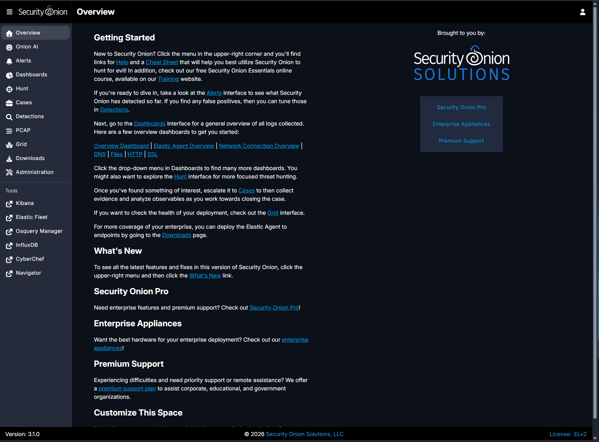
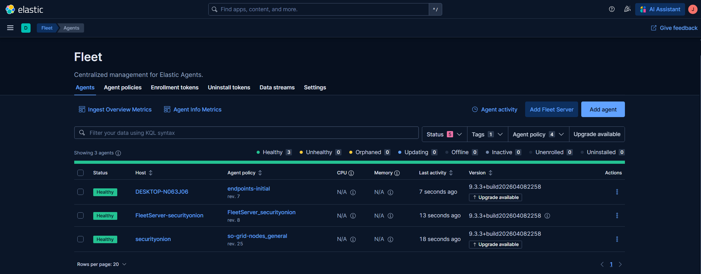
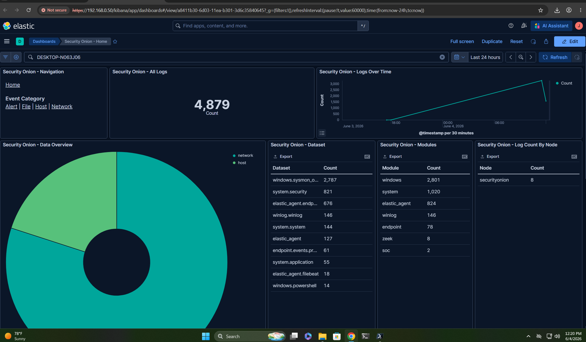

# 🏠 Home SOC Build — Security Onion 3.1.0


> A fully functional home Security Operations Center built from scratch, documenting real-world SOC workflows including telemetry collection, endpoint monitoring, threat detection, and MITRE ATT&CK mapped attack simulations.

---

## 📸 Live Dashboard


*Security Onion 3.1.0 Kibana dashboard showing 4,879+ events from Windows 11 endpoint DESKTOP-N063J06*

---

## 📋 Table of Contents

- [Project Overview](#-project-overview)
- [Architecture](#-architecture)
- [Tools and Technologies](#-tools-and-technologies)
- [Build Phases](#-build-phases)
- [MITRE ATT&CK Coverage](#-mitre-attck-coverage)
- [Pipeline Verification](#-pipeline-verification)
- [Attack Simulations](#-attack-simulations)
- [Documentation](#-documentation)
- [Known Issues and Fixes](#-known-issues-and-fixes)
- [Future Roadmap](#-future-roadmap)
- [Author](#-author)

---

## 🔍 Project Overview

This project documents the end-to-end build of a home Security Operations Center using enterprise-grade open source tooling. The goal was not to follow a tutorial, but to design and build a real detection pipeline from scratch, troubleshoot real problems, and demonstrate the kind of SOC workflows used by defense contractors and federal cybersecurity organizations.

**Security Onion is used by real government and military organizations.** Building and operating it at home, even in a lab environment, demonstrates direct familiarity with tools and workflows relevant to those environments.

The build spans two physical machines connected over a home network, with a Security Onion standalone sensor on the desktop and a Windows 11 endpoint VM on the laptop. Every phase is documented with the same level of detail a professional would bring to a work environment.

### What this project demonstrates

| Skill | How it is demonstrated |
|---|---|
| SOC infrastructure deployment | Security Onion 3.1.0 standalone on VMware with dual NIC configuration |
| Endpoint telemetry collection | Sysmon v15.20 with SwiftOnSecurity config shipping events via Elastic Agent |
| SIEM log analysis | Kibana dashboard with 4,879+ events from endpoint including Sysmon operational data |
| Threat detection and alerting | Security Onion Hunt and Alerts views with live detections |
| Adversary simulation | Invoke-AtomicRedTeam mapped to MITRE ATT&CK techniques |
| Network security monitoring | Zeek and Suricata running on monitor NIC |
| Incident response lifecycle | Detection through documentation following NIST IR phases |
| Real-world troubleshooting | Two documented production-level issues identified and resolved |

---

## 🏗️ Architecture

```
┌─────────────────────────────────────────────────────────────┐
│                    HOME NETWORK 192.168.0.0/24              │
│                                                             │
│  ┌──────────────────────┐    ┌─────────────────────────┐   │
│  │   DESKTOP SOC MACHINE │    │  LAPTOP ENDPOINT MACHINE │   │
│  │   192.168.0.2        │    │  192.168.0.15 (DHCP)    │   │
│  │                      │    │                         │   │
│  │  ┌────────────────┐  │    │  ┌───────────────────┐  │   │
│  │  │ Security Onion │  │    │  │  Windows 11 VM    │  │   │
│  │  │ 3.1.0          │  │    │  │  Enterprise Eval  │  │   │
│  │  │ 192.168.0.50   │◄─┼────┼──│                   │  │   │
│  │  │                │  │    │  │  - Sysmon v15.20  │  │   │
│  │  │ - Kibana       │  │    │  │  - Elastic Agent  │  │   │
│  │  │ - Elasticsearch│  │    │  │  - Invoke-Atomic  │  │   │
│  │  │ - Zeek         │  │    │  │  - PowerShell 7   │  │   │
│  │  │ - Suricata     │  │    │  └───────────────────┘  │   │
│  │  │ - Elastic Fleet│  │    │                         │   │
│  │  └────────────────┘  │    └─────────────────────────┘   │
│  └──────────────────────┘                                   │
└─────────────────────────────────────────────────────────────┘

Telemetry Flow:
Sysmon Events → Elastic Agent → Security Onion Fleet → Elasticsearch → Kibana
```

### Hardware Specifications

| Component | Desktop (SOC Machine) | Laptop (Endpoint Machine) |
|---|---|---|
| CPU | AMD Ryzen 9 | AMD Ryzen 9 9955HX 16-Core |
| RAM | 64GB | 64GB |
| Storage | 1TB | 3.68TB |
| OS | Windows 11 (host) | Windows 11 Pro (host) |
| VMware | Workstation Pro | Workstation Pro 26H1 |
| Role | Security Onion sensor | Windows 11 endpoint VM |

### Security Onion VM Specs

| Setting | Value |
|---|---|
| RAM | 32GB |
| CPU Cores | 8 |
| Disk | 500GB NVMe |
| OS | Oracle Linux Server 9.7 |
| Management NIC | ens160 (Bridged) |
| Monitor NIC | ens224 (Host-only) |
| Static IP | 192.168.0.50 |
| Web Interface | https://192.168.0.50 |

---

## 🛠️ Tools and Technologies

| Tool | Version | Purpose |
|---|---|---|
| Security Onion | 3.1.0 | NSM platform, SIEM, threat hunting |
| Elasticsearch | Built-in | Log storage and search backend |
| Kibana | Built-in | Log visualization and dashboards |
| Elastic Fleet | Built-in | Endpoint agent management |
| Zeek | Built-in | Network protocol analysis |
| Suricata | Built-in | Network intrusion detection |
| Sysmon | v15.20 | Windows endpoint telemetry |
| Elastic Agent | Latest | Log shipping from endpoint to SO |
| Invoke-AtomicRedTeam | v2.1.0 | MITRE ATT&CK attack simulation |
| PowerShell | 7.6.2 | Scripting and test execution |
| VMware Workstation | Pro 26H1 | Virtualization platform |
| SwiftOnSecurity Config | Schema 4.50 | Sysmon rule configuration |

---

## 📅 Build Phases

### ✅ Phase 1 — Desktop SOC Machine (Complete)

Deployed Security Onion 3.1.0 Standalone on a VMware VM running Oracle Linux Server 9.7. Configured dual NIC setup with a bridged management interface and host-only monitor interface. Set static IP, configured DNS, and verified the web interface and Kibana were live.

**Key steps:**
- Downloaded and SHA256 verified Security Onion 3.1.0 ISO
- Created VMware VM with 32GB RAM, 8 cores, 500GB NVMe, dual NIC
- Completed Security Onion setup wizard (Standalone node)
- Configured static IP 192.168.0.50 with subnet 255.255.255.0
- Verified web interface at https://192.168.0.50
- Confirmed Kibana collecting telemetry


📄 [Full Phase 1 Documentation →](docs/03-security-onion-install.md)

---

### ✅ Phase 2 — Windows 11 Endpoint Setup (Complete)

Configured a Windows 11 Enterprise Evaluation VM on the laptop as the monitored endpoint. Installed Sysmon with the SwiftOnSecurity config for enhanced Windows telemetry. Installed Invoke-AtomicRedTeam and the full Atomic Red Team atomics library. Enrolled Elastic Agent in Security Onion Fleet and verified the end-to-end telemetry pipeline.

**Key steps:**
- Created Windows 11 Enterprise Evaluation VM (8GB RAM, 4 cores, 100GB)
- Installed Sysmon v15.20 with SwiftOnSecurity config (schema 4.50)
- Installed Invoke-AtomicRedTeam v2.1.0 with auto-load PowerShell profile
- Installed Atomic Red Team atomics library to C:\AtomicRedTeam\atomics
- Configured Security Onion firewall hostgroup for elastic_agent_endpoint
- Enrolled Elastic Agent in Fleet, confirmed HEALTHY status
- Verified 4,879+ events flowing in Kibana




📄 [Full Phase 2 Documentation →](docs/04-endpoint-vm-setup.md)

---

### 🔄 Phase 3 — Attack Simulations (In Progress)

Running MITRE ATT&CK mapped attack simulations using Invoke-AtomicRedTeam against the Windows 11 endpoint and verifying detections in Security Onion Hunt and Alerts views. Each technique is documented with command output, detection evidence, and MITRE ATT&CK mapping.

📄 [Attack Simulation Results →](attack-simulations/findings-summary.md)

---

### 📋 Phase 4 — GitHub and LinkedIn (In Progress)

Building out this repository with full documentation for every phase. Publishing a six-post LinkedIn series documenting the complete build for defense contractor and federal cybersecurity hiring audiences.

---

## 🎯 MITRE ATT&CK Coverage

| Technique | ID | Tactic | Status | Detection |
|---|---|---|---|---|
| PowerShell Execution | T1059.001 | Execution | 🔄 In Progress | TBD |
| Credential Dumping | T1003 | Credential Access | 🔄 In Progress | TBD |
| Valid Accounts | T1078 | Defense Evasion / Persistence | 🔄 In Progress | TBD |

*Table will be updated as Phase 3 simulations complete.*

---

## ✅ Pipeline Verification

The full telemetry pipeline was verified end to end before attack simulations began.

**Elastic Fleet Status:**

| Agent | Hostname | Status | Policy |
|---|---|---|---|
| Elastic Agent | DESKTOP-N063J06 | ✅ HEALTHY | endpoints-initial |

**Kibana Event Counts (24-hour window):**

| Dataset | Event Count |
|---|---|
| windows.sysmon_operational | 2,787 |
| system.security | 821 |
| elastic_agent.endp | 676 |
| winlog.winlog | 146 |
| windows.powershell | 14 |
| **Total** | **4,879+** |

**Hunt View Query:**
```
host.hostname: DESKTOP-N063J06 AND event.dataset: windows.sysmon_operational
```



📄 [Full Pipeline Verification Documentation →](docs/07-pipeline-verification.md)

---

## ⚔️ Attack Simulations

Attack simulations are run using Invoke-AtomicRedTeam on the Windows 11 endpoint VM. Before each test a VM snapshot is taken to allow rollback. Detections are verified in Security Onion Hunt and Alerts views.

**Simulation workflow:**
1. Take VMware snapshot of Windows 11 endpoint
2. Run Invoke-AtomicTest for selected MITRE technique
3. Monitor Security Onion Hunt view for events
4. Check Alerts view for triggered detections
5. Document findings with screenshots
6. Restore snapshot if needed

```powershell
# Example: Run T1059.001 PowerShell execution test
Invoke-AtomicTest T1059.001 -TestNumbers 1
```

📄 [T1059.001 Results →](attack-simulations/T1059-results.md)
📄 [T1003 Results →](attack-simulations/T1003-results.md)
📄 [T1078 Results →](attack-simulations/T1078-results.md)
📄 [Findings Summary →](attack-simulations/findings-summary.md)

---

## 📁 Documentation

| Document | Description | Status |
|---|---|---|
| [01 - Hardware and Planning](docs/01-hardware-and-planning.md) | Hardware specs, architecture decisions, network setup | 🔄 In Progress |
| [02 - VMware Setup](docs/02-vmware-setup.md) | VM creation, dual NIC config, known issues and fixes | 🔄 In Progress |
| [03 - Security Onion Install](docs/03-security-onion-install.md) | ISO verification, setup wizard walkthrough, all config choices | 🔄 In Progress |
| [04 - Endpoint VM Setup](docs/04-endpoint-vm-setup.md) | Windows 11 VM, VMware Tools, PowerShell 7, snapshot strategy | 🔄 In Progress |
| [05 - Sysmon Configuration](docs/05-sysmon-configuration.md) | Sysmon install, SwiftOnSecurity config, event ID reference | 🔄 In Progress |
| [06 - Elastic Agent Setup](docs/06-elastic-agent-setup.md) | Agent install, Fleet enrollment, firewall configuration | 🔄 In Progress |
| [07 - Pipeline Verification](docs/07-pipeline-verification.md) | End-to-end verification, Kibana queries, Hunt view setup | 🔄 In Progress |
| [08 - Attack Simulations](docs/08-attack-simulations.md) | Invoke-AtomicRedTeam usage, test methodology, results | 🔄 In Progress |

---

## 🔧 Known Issues and Fixes

These are real troubleshooting events encountered during the build. Documented here because real problem-solving ability matters as much as following instructions.

### Issue 1: VMware Losing Track of .vmdk File After Shutdown

**Problem:** After shutting down the Security Onion VM, VMware Workstation would lose track of the `.vmdk` disk file on the G: drive and fail to power the VM back on.

**Root Cause:** The G: drive VMware folder did not have sufficient permissions for VMware to access the disk file after a fresh Windows session.

**Fix:**
1. Right-click the VMware folder on G: drive
2. Select Properties > Security > Edit
3. Click Add and enter your Windows username
4. Grant Full Control to your user account
5. Apply to all subfolders and files
6. Click OK

> **Security Note:** Adding `Everyone` with Full Control is a common suggestion online but is overly permissive. Granting access to your specific user account instead follows the principle of least privilege and is the correct approach for any production or lab environment.

**Why this matters:** Permission issues on external or secondary drives are a common real-world VMware deployment problem. Applying least privilege by granting access only to the required user account rather than Everyone demonstrates security-conscious thinking that directly maps to enterprise security hardening practices.

---

### Issue 2: Laptop Cannot Reach Security Onion at 192.168.0.50

**Problem:** The Windows 11 endpoint VM on the laptop could not reach the Security Onion web interface or enroll the Elastic Agent.

**Root Cause:** The laptop was connected to a Google Nest WiFi router which creates a separate subnet (e.g. 192.168.86.x) isolated from the main router subnet (192.168.0.x). Security Onion at 192.168.0.50 is not reachable from a different subnet without routing.

**Fix:** Connect the laptop to the main router WiFi only. The Google Nest must not be used for any lab work involving the Security Onion pipeline.

**Why this matters:** Subnet isolation is a fundamental networking concept. Recognizing that double NAT and separate subnets break direct IP communication is a real-world troubleshooting skill that maps directly to enterprise network segmentation problems.

---

## 🗺️ Future Roadmap

| Project | Description | Priority |
|---|---|---|
| Structured Threat Hunt Campaign | Hypothesis-driven hunt using MITRE ATT&CK Discovery (TA0007) | High |
| pfSense Firewall Integration | Add pfSense VM for network segmentation and firewall log collection | Medium |
| Managed Switch + SPAN Port | TP-Link TL-SG108E for full network traffic capture | Medium |
| OpenCanary Honeypot | Deploy honeypot VM and route alerts into Security Onion | Medium |
| Elasticsearch MCP + Claude Code | AI-assisted SOC analyst pipeline querying Security Onion data | Medium |
| Python Detection Pipeline | Automated Atomic Red Team testing with GitHub reporting | Medium |
| Automated SO Deployment | Packer + Terraform + Ansible pipeline for reproducible SOC builds | Low |
| Microsoft Sentinel Integration | Cloud SIEM alongside on-prem Security Onion | Low |
| Formal IR Playbook | Complete incident response report using full NIST IR lifecycle | Low |

---

## 👤 Author

**Joshua Howard**
University of Arizona | BAS Cyber Operations Defense and Forensics
NSA CAE-CO Aligned Curriculum | Final Year

Targeting entry-level SOC Analyst and Junior DevSecOps Engineer roles at defense contractors and federal cybersecurity organizations.

[](https://www.linkedin.com/in/joshuawilliamhoward/)
[](https://github.com/jhoward98)

---

## 📄 License

This project is licensed under the MIT License. See [LICENSE](LICENSE) for details.

---

<p align="center"><i>Built from scratch. Documented in public. One detection at a time.</i></p>
