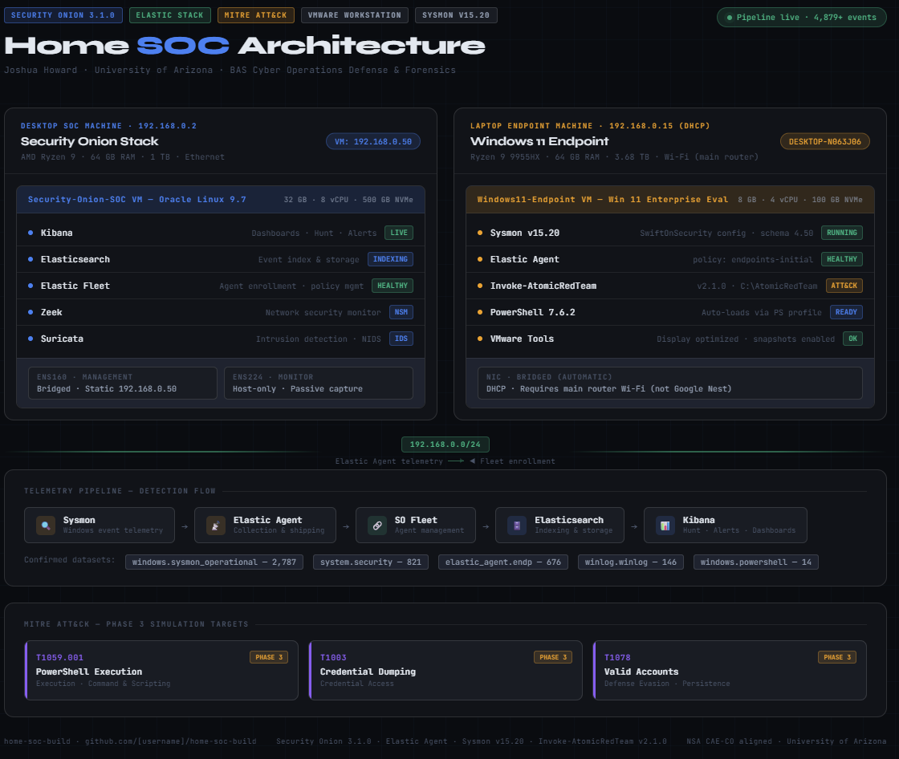

# 01 - Hardware and Planning

## Overview

This document covers the planning and hardware foundation for the home SOC build. Before any software is installed, a SOC needs a deliberate design: which machines play which role, how they talk to each other, how resources are allocated, and what the network looks like. This phase produces the blueprint that every later phase depends on.

Getting the plan right here prevents painful rework later, such as discovering an endpoint cannot reach the sensor or that a virtual machine was starved of memory. Nothing is detected yet in this phase, but every detection that happens later is only possible because of the decisions documented here.

---

## Objectives

By the end of this phase you will have:

- A documented hardware inventory for both machines
- A clear role assignment, meaning which machine is the SOC sensor and which is the monitored endpoint
- A complete network address plan
- A resource allocation plan for each virtual machine
- A finished pre-build checklist confirming you are ready to create virtual machines

### Where this fits in the incident response lifecycle

In the NIST incident response lifecycle (Preparation, Detection and Analysis, Containment Eradication and Recovery, and Post-Incident Activity), this entire phase lives in **Preparation**. Preparation is the work you do before an incident ever happens: standing up tooling, building visibility, and making sure the systems are ready. A SOC that has not done its preparation cannot detect or respond to anything. Designing the architecture so that it produces the right telemetry is preparation in its purest form.

---

## Design Goals

A short list of the principles that drove every decision in this build:

1. **Separation of roles.** The detection stack and the monitored endpoint live on different physical machines, exactly like a real enterprise SOC where sensors and endpoints are distinct systems.
2. **Realistic telemetry.** The endpoint is configured to produce the same kinds of logs a real Windows workstation produces, so detections map to genuine adversary behavior.
3. **Enterprise-grade, open source tooling.** Security Onion is free, open source, and used by real government and military organizations, which makes it both accessible for a home lab and directly relevant to defense and federal hiring.
4. **Reproducibility and documentation.** Every choice is recorded so the build could be rebuilt from scratch by someone with zero prior knowledge.

---

## Hardware Inventory

### Desktop (SOC Machine)

This is the heavy lifter. It hosts the Security Onion virtual machine, which runs the entire detection stack: Elasticsearch, Kibana, Elastic Fleet, Zeek, and Suricata.

| Component | Specification |
|---|---|
| CPU | AMD Ryzen 9 |
| RAM | 64 GB |
| Storage | 1 TB |
| Host OS | Windows 11 |
| Network | Wired Ethernet |
| Host IP | 192.168.0.2 |
| Role | Security Onion standalone sensor and SIEM |

**Why wired Ethernet:** the SOC machine carries continuous telemetry and runs the search backend. A wired connection gives it stable, low latency network access, which matters for a host that other devices depend on.

### Laptop (Endpoint Machine)

This machine hosts the Windows 11 endpoint VM that we monitor. It is the workstation under observation in the lab and is deliberately the lighter of the two workloads.

| Component | Specification |
|---|---|
| CPU | AMD Ryzen 9 9955HX (16-core) |
| RAM | 64 GB |
| Storage | 3.68 TB total |
| Dedicated VM drive | 2 TB Samsung 990 Pro (E:) |
| GPU | NVIDIA GeForce RTX 5070 Ti Laptop GPU |
| Host OS | Windows 11 Pro |
| Hypervisor | VMware Workstation Pro 26H1 |
| Role | Hosts the monitored Windows 11 endpoint VM |

**Design note:** all VM files live on the dedicated 2 TB Samsung 990 Pro (E:) rather than the system drive. Keeping virtual machines on a separate, fast NVMe drive improves performance and keeps the host operating system drive clean. This is a small decision that pays off in stability.

---

## Virtual Machine Plan

Two virtual machines make up the lab. Their specifications are sized for their jobs.

### Security Onion VM (on the desktop)

| Setting | Value |
|---|---|
| VM Name | Security-Onion-SOC |
| Location | G:\VMWare\Security-Onion-SOC |
| Guest OS | Oracle Linux Server 9.7 |
| RAM | 32 GB |
| CPU Cores | 8 |
| Disk | 500 GB NVMe |
| Management NIC | Bridged (ens160) |
| Monitor NIC | Host-only (ens224) |
| Static IP | 192.168.0.50 |
| Web Interface | https://192.168.0.50 |

**Why these resources:** Security Onion runs a full Elastic stack plus Zeek and Suricata inside Docker containers. That is a memory hungry and CPU hungry workload. 32 GB of RAM and 8 cores is a comfortable allocation for a standalone node monitoring a single endpoint in a home lab. Under-provisioning Security Onion is the most common reason home installs feel slow or fail to come up cleanly, so this build gives it room to breathe.

### Windows 11 Endpoint VM (on the laptop)

| Setting | Value |
|---|---|
| VM Name | Windows11-Endpoint |
| Location | E:\VMware\Windows11-Endpoint |
| Guest OS | Windows 11 Enterprise Evaluation (90 day, rearmable) |
| RAM | 8 GB |
| CPU Cores | 4 |
| Disk | 100 GB NVMe |
| Network | Bridged (Automatic) |

**Why Enterprise Evaluation:** the Windows 11 Enterprise Evaluation edition is free, legitimate for lab use, and rearmable, which means the 90 day trial can be reset to keep the lab running. It also includes the enterprise features that make for realistic telemetry.

**Why lighter resources:** this VM only runs Windows, Sysmon, the Elastic Agent, and the occasional attack simulation. 8 GB and 4 cores is plenty and leaves the laptop host responsive.

---

## Network Design

The entire lab lives on a single flat subnet so that every device can reach every other device by IP without routing or firewall hops getting in the way. This is the simplest reliable design for a home lab.

| Device | Role | IP Address | Assignment |
|---|---|---|---|
| Router / Gateway | Gateway and DHCP | 192.168.0.1 | Static |
| Desktop host | SOC host OS | 192.168.0.2 | Host |
| Security Onion VM | NSM sensor and SIEM | 192.168.0.50 | Static |
| Windows 11 Endpoint VM | Monitored endpoint | 192.168.0.15 | DHCP |

| Network Setting | Value |
|---|---|
| Subnet | 192.168.0.0/24 |
| Subnet Mask | 255.255.255.0 |
| Gateway | 192.168.0.1 |
| DNS Servers | 8.8.8.8 and 8.8.4.4 |
| DNS Search Domain | securityonionsoc.local |
| Allowed Subnet (Security Onion firewall) | 192.168.0.0/24 |

### Why the Security Onion VM uses two network interfaces

This is one of the most important design decisions in the whole build, and it mirrors how real network security monitoring sensors are deployed.

- **Management NIC (Bridged, ens160, static 192.168.0.50).** This is the interface you use to administer the sensor: reaching the web interface, enrolling agents, and receiving endpoint telemetry. Bridged mode puts the VM directly on the home network as if it were its own physical device, which is why it gets a real static IP on the 192.168.0.0/24 subnet.
- **Monitor NIC (Host-only, ens224).** This interface exists to passively observe network traffic. Zeek and Suricata watch this interface to generate network logs and intrusion alerts. It does not need an internet-routable IP because its only job is to listen.

Splitting administration from monitoring is standard sensor design. The management plane and the monitoring plane stay separate, which is cleaner, more secure, and closer to how an enterprise sensor is wired.

### Critical network rule: stay on the main router

The laptop must connect to the **main router WiFi**, not the Google Nest mesh. This is a planning constraint worth calling out before the build, because it is easy to trip over.

A Google Nest mesh router creates its own separate subnet (for example 192.168.86.x) behind a second layer of NAT. A device on that subnet cannot reach the Security Onion sensor at 192.168.0.50, because they live on different networks with no route between them. The fix is simple: keep every lab device on the main router so they all share the 192.168.0.0/24 subnet. Plan your wireless connection before you start, and the pipeline just works.

> This issue and its root cause are documented in full in the repository README under Known Issues and Fixes.

---

## Architecture Overview

The diagram below shows the complete planned design: the two machines, their virtual machines, the tools running on each, the dual-NIC layout, and the telemetry flow from the endpoint to the analyst dashboards.

*Click the diagram to open the fully interactive version, where every component is clickable and shows configuration notes, tool versions, and detection context.*

Reading the diagram left to right: the Windows 11 endpoint on the laptop generates Sysmon and Windows event telemetry. The Elastic Agent collects and ships that telemetry to Security Onion's Fleet, which lands it in Elasticsearch for indexing and storage. Kibana then makes it searchable and visual through Dashboards, the Hunt view, and the Alerts view. Zeek and Suricata add network level visibility from the monitor interface.

**Telemetry flow:**

`Sysmon Events` → `Elastic Agent` → `Security Onion Fleet` → `Elasticsearch` → `Kibana`

---

## Tooling Plan

A summary of what will be installed and where, so the later phases have a clear target. Each tool is covered in detail in its own document.

| Tool | Where it runs | Purpose | Covered in |
|---|---|---|---|
| Security Onion 3.1.0 | Desktop VM | NSM platform, SIEM, threat hunting | 03 |
| Elasticsearch / Kibana / Fleet | Desktop VM (built-in) | Storage, visualization, agent management | 03, 07 |
| Zeek and Suricata | Desktop VM (built-in) | Network monitoring and intrusion detection | 03 |
| Sysmon v15.20 | Endpoint VM | Windows endpoint telemetry | 05 |
| Elastic Agent | Endpoint VM | Ships endpoint logs to Security Onion | 06 |
| Invoke-AtomicRedTeam v2.1.0 | Endpoint VM | MITRE ATT&CK attack simulation | 08 |
| PowerShell 7.6.2 | Endpoint VM | Scripting and test execution | 04, 05 |

---

## How this maps to MITRE ATT&CK

Planning a SOC is not just about buying hardware. It is about deciding what you will be able to see, because you can only detect what you collect. The MITRE ATT&CK framework describes adversary tactics and techniques and, just as importantly, the data sources needed to detect them. This build's architecture was chosen so that the telemetry it produces maps to the ATT&CK data sources behind the techniques planned for Phase 3.

| Planned data source | Comes from | Supports detecting (examples) |
|---|---|---|
| Process creation | Sysmon Event ID 1 | T1059.001 PowerShell Execution |
| Process access | Sysmon Event ID 10 | T1003 OS Credential Dumping |
| Authentication and logon | Windows Security log (Event IDs 4624, 4672) | T1078 Valid Accounts |
| Network connection | Sysmon Event ID 3, Zeek logs | Command and control, discovery |

In short, the architecture is designed backward from the detections we want to achieve. That is exactly how a real detection engineering effort starts.

---

## Pre-Build Checklist

Confirm all of the following before moving on to creating virtual machines in Document 02.

- [ ] Desktop SOC machine available with at least 32 GB of RAM free for the VM
- [ ] Laptop endpoint machine available with a dedicated drive for VM files (E:)
- [ ] VMware Workstation Pro installed on both machines
- [ ] Home network using a single subnet (192.168.0.0/24)
- [ ] Laptop confirmed connected to the main router, not the Google Nest
- [ ] Static IP 192.168.0.50 reserved for the Security Onion sensor and not handed out by DHCP
- [ ] Gateway (192.168.0.1) and DNS values (8.8.8.8, 8.8.4.4) recorded
- [ ] Architecture diagram reviewed and understood

When every box is checked, you are ready to build the virtual machines.

---

## What's Next

With the plan in place and the hardware confirmed, the next phase creates the virtual machine that will host Security Onion, including the all important dual-NIC configuration.

➡️ Continue to [02 - VMware Setup](02-vmware-setup.md)
