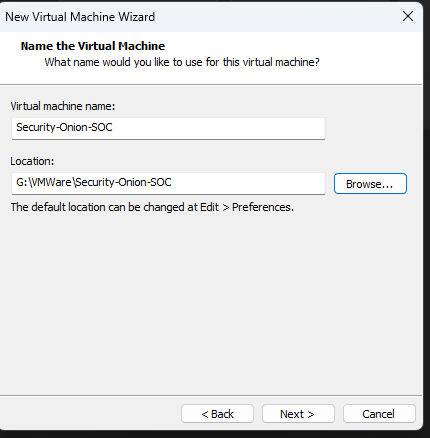
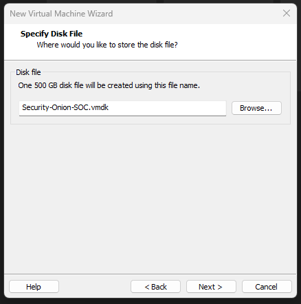
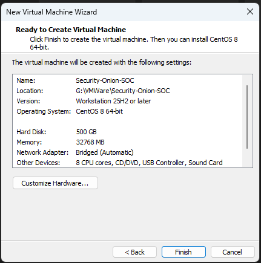
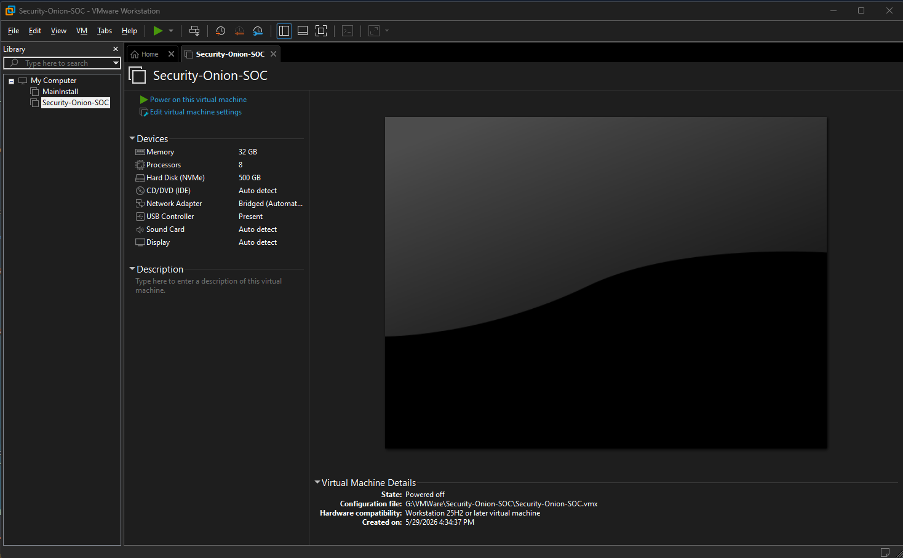
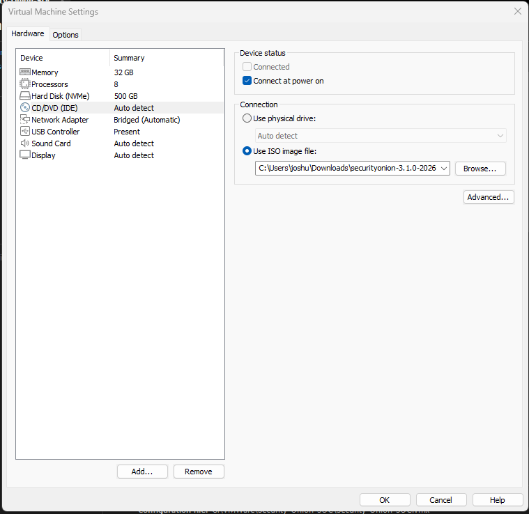
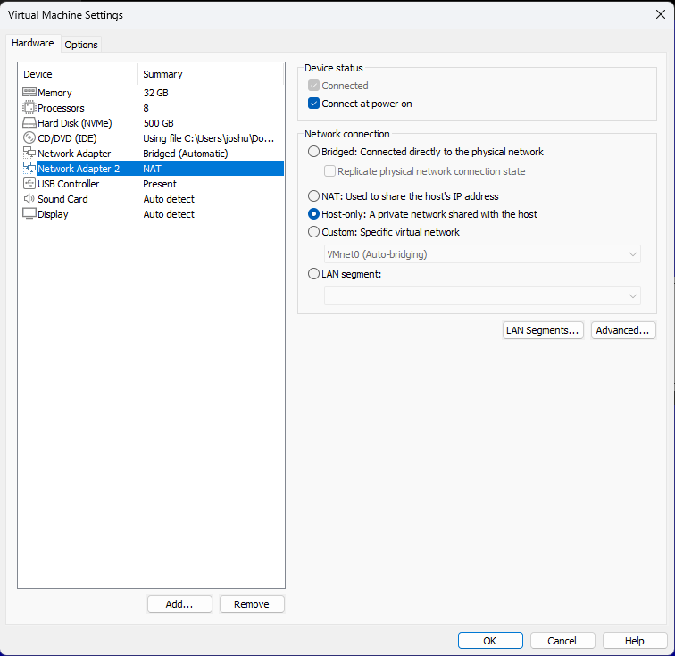

# 02 - VMware Setup

## Overview

This document creates the virtual machine that will host Security Onion on the desktop. This is the empty shell: the right CPU, memory, disk, network interfaces, and attached install media, all configured before the operating system is installed. Nothing is installed inside the VM yet. The goal is a correctly specced VM, powered off and ready to boot into the Security Onion installer in Doc 03.

This document also covers the single most important hardware decision in the build, the dual network interface configuration, and a real troubleshooting issue, the G: drive permissions fix, that was solved during this phase.

The Windows 11 endpoint VM on the laptop is created later in Doc 04. This document is only about the Security Onion VM.

---

## Objectives

By the end of this phase you will have:

- A VMware virtual machine named `Security-Onion-SOC` with 32 GB RAM, 8 CPU cores, and a 500 GB NVMe disk
- Two network adapters configured: a bridged management interface and a host-only monitor interface
- The Security Onion 3.1.0 ISO attached and set to connect at power on
- A documented fix for the G: drive permissions issue
- A VM powered off and ready to install Security Onion

### Where this fits in the incident response lifecycle

This is still the **Preparation** phase. Building the host that will run the detection stack is foundational preparation. A correctly configured sensor VM with the right network visibility is what makes detection possible later.

---

## Prerequisites

Before starting, confirm:

- VMware Workstation Pro is installed on the desktop (this build uses Pro 26H1)
- The desktop meets the hardware requirements from Doc 01 (at least 32 GB of RAM free and room on the G: drive for a 500 GB disk)
- The Security Onion 3.1.0 ISO is downloaded to the desktop

> **Note:** downloading the Security Onion ISO and verifying its SHA256 hash is documented in Doc 03. You need the ISO file present on disk to complete the attach-media step in this document.

---

## Step 1: Open the New Virtual Machine Wizard

In VMware Workstation Pro, go to **File > New Virtual Machine**, or press **Ctrl + N**.

When prompted to choose a configuration type, select **Custom (advanced)** and click Next. Custom gives you direct control over the disk type and network settings, which this build needs.

## Step 2: Hardware compatibility

Leave the hardware compatibility at the default (this build shows Workstation 25H2 or later) and click Next.

## Step 3: Choose "I will install the operating system later"

On the guest operating system installation screen, select **I will install the operating system later**, then click Next.

**Why this matters:** this avoids VMware's "easy install" automation, which is designed for desktop operating systems and does not suit a Security Onion install. Choosing to install later gives you a clean, manual installation directly from the ISO, which is the recommended approach.

## Step 4: Select the guest operating system

Choose **Linux** as the guest operating system, then select **CentOS 8 64-bit** from the version dropdown. Click Next.

**Important clarification:** VMware does not list Oracle Linux 9.7 as a guest type, so CentOS 8 64-bit is selected as the closest RHEL-compatible profile. The guest operating system type is only a hint VMware uses to pick sensible default settings. It does not need to match exactly. The actual operating system that installs from the Security Onion ISO is Oracle Linux Server 9.7, which is the base OS for Security Onion 3.x.

## Step 5: Name the virtual machine and set its location

- Virtual machine name: `Security-Onion-SOC`
- Location: `G:\VMWare\Security-Onion-SOC`

Click Next.

*Naming the VM Security-Onion-SOC and storing it on the G: drive.*

## Step 6: Configure processors

Set the total number of processor cores to **8**. For example, set Number of processors to 1 and Number of cores per processor to 8, which gives 8 cores total. Click Next.

## Step 7: Configure memory

Set the memory to **32 GB**. VMware uses megabytes here, so enter **32768 MB**. Click Next.

**Why 32 GB:** Security Onion runs a full Elastic stack plus Zeek and Suricata inside Docker. This is a memory hungry workload, and 32 GB is a comfortable allocation for a standalone node. The full reasoning is in Doc 01.

## Step 8: Network type

Select **Use bridged networking** and click Next.

This becomes the first network adapter, the management interface. Bridged mode places the VM directly on your home network with its own IP on the 192.168.0.0/24 subnet. We will add the second adapter, the monitor interface, after the VM is created.

## Step 9: I/O controller and disk type

- Accept the recommended I/O controller type and click Next.
- For the disk type, select **NVMe** and click Next.

NVMe is the modern, high performance virtual disk interface and is what this build uses. You will see the disk listed as `Hard Disk (NVMe)` in the settings.

## Step 10: Create the virtual disk

- Select **Create a new virtual disk** and click Next.
- Set the maximum disk size to **500 GB**.
- Select **Store virtual disk as a single file**.
- Click Next.
- The disk file name auto-fills as `Security-Onion-SOC.vmdk`. Click Next.

*A single 500 GB disk file named Security-Onion-SOC.vmdk. Storing the disk as one file keeps things simple and performs well on a dedicated drive.*

## Step 11: Review and finish

Review the summary. It should show the name, location, guest OS (CentOS 8 64-bit), a 500 GB disk, 32768 MB of memory, a bridged network adapter, and 8 CPU cores. Click Finish.

*The Ready to Create summary. The guest OS shows CentOS 8 64-bit, as explained in Step 4.*

The VM now appears in your VMware Library, powered off.

*Security-Onion-SOC created and powered off, with 32 GB RAM, 8 processors, and a 500 GB NVMe disk. The configuration file lives at G:\VMWare\Security-Onion-SOC\Security-Onion-SOC.vmx.*

## Step 12: Attach the Security Onion ISO

With the VM selected, click **Edit virtual machine settings**. On the Hardware tab:

1. Select **CD/DVD (IDE)**.
2. On the right, choose **Use ISO image file**.
3. Click **Browse** and select `securityonion-3.1.0-20260528.iso` from your Downloads folder.
4. Confirm **Connect at power on** is checked.

*The CD/DVD drive set to boot from the Security Onion 3.1.0 ISO, with Connect at power on enabled.*

## Step 13: Add the second network adapter (the monitor NIC)

This is the most important step in this document. Still in Virtual Machine Settings on the Hardware tab:

1. Click **Add** at the bottom.
2. Select **Network Adapter** and click Finish.
3. Select the new **Network Adapter 2**.
4. On the right, set its network connection to **Host-only**.
5. Click **OK**.

*Network Adapter set to Bridged (the management interface) and Network Adapter 2 set to Host-only (the passive monitor interface).*

You now have two network adapters:

| Adapter | VMware mode | Role | Interface name in Security Onion |
|---|---|---|---|
| Network Adapter | Bridged (Automatic) | Management | ens160 |
| Network Adapter 2 | Host-only | Monitor (passive capture) | ens224 |

**Why two adapters:** Both adapters belong to the same machine, the Security Onion VM. They are two virtual network cards on that one VM, and what separates them is their VMware connection mode and their job, not which machine they serve.

- **Bridged (management, ens160)** runs through the desktop's physical adapter and out onto your real home network, so the VM appears on the 192.168.0.0/24 subnet as its own device at 192.168.0.50. This is how you administer the sensor, how the endpoint's Elastic Agent ships telemetry in, and how the VM reaches the internet.
- **Host-only (monitor, ens224)** is a VMware mode that creates a private virtual network isolated from your physical LAN and the internet. The name refers to that isolation, not to ownership of the adapter. This interface exists purely so Zeek and Suricata have a dedicated, passive place to listen, kept separate from management traffic.

Keeping the management plane separate from the monitoring plane is standard sensor design. The full rationale is in Doc 01.

**A note on feeding the monitor interface:** On its own, a host-only interface only sees traffic on its isolated virtual network. It does not automatically see the Windows endpoint's traffic, because the endpoint lives on the bridged side, on a separate machine. To deliver real endpoint network traffic to this interface, you mirror it using a managed switch with a SPAN (Switched Port Analyzer) port, which sends a read-only copy of the traffic to the sensor without sitting in its path. That is the role of the TP-Link TL-SG108E managed switch in the Future Roadmap. Until then, endpoint visibility still comes through strongly, because the Elastic Agent delivers Sysmon and Windows logs over the management interface, which is the source of the 4,879+ events in this build. The SPAN port is what fully lights up the network-capture half of the sensor.

---

## Verification

Before moving on, confirm the following in VMware:

- [ ] A VM named Security-Onion-SOC appears in the VMware Library
- [ ] Memory shows 32 GB
- [ ] Processors shows 8
- [ ] Hard Disk (NVMe) shows 500 GB
- [ ] CD/DVD points to the Security Onion ISO with Connect at power on checked
- [ ] Two network adapters exist: one Bridged, one Host-only
- [ ] State is Powered off
- [ ] Configuration file is at G:\VMWare\Security-Onion-SOC\Security-Onion-SOC.vmx

When all boxes are checked, the VM is ready for the Security Onion install in Doc 03.

---

## Troubleshooting

### Issue: VMware loses track of the .vmdk file on the G: drive after shutdown

This was a real issue encountered during the build and is worth documenting because it is a common problem when VM files live on a secondary drive.

**Symptom:** After shutting down the Security Onion VM, VMware Workstation could not find the `.vmdk` disk file on the G: drive on the next session and failed to power the VM back on.

**Root cause:** The VMware folder on the G: drive did not have sufficient permissions for VMware to access the disk file after a fresh Windows session.

**Fix:**

1. Right-click the VMware folder on the G: drive.
2. Select **Properties**, then the **Security** tab, then **Edit**.
3. Click **Add** and enter your Windows user account name.
4. Grant **Full Control** to your user account.
5. Apply to all subfolders and files.
6. Click **OK**.

> **Security note: use least privilege.** A very common suggestion online is to add the `Everyone` group with Full Control. That works, but it is overly permissive and grants access to every account on the system. Granting Full Control to only your specific user account achieves the same result while following the principle of least privilege. This is the correct approach for any lab or production environment, and it is a small but real example of security-conscious thinking that maps directly to enterprise hardening practices.

---

## How this maps to MITRE ATT&CK

The dual-NIC design is not just a networking detail. The host-only monitor interface is what allows Zeek and Suricata to passively observe network traffic, which produces the network telemetry behind several ATT&CK data sources, including Network Traffic and Network Connection Creation. Without the monitor interface, the sensor would be blind to network level adversary behavior such as command and control or lateral movement. Building this visibility in now is a deliberate detection engineering decision.

---

## What's Next

The VM is built and ready. The next phase boots it from the attached ISO, verifies the ISO integrity, and walks through the full Security Onion setup wizard.

➡️ Continue to [03 - Security Onion Install](03-security-onion-install.md)
