# 03 - Security Onion Install

## Overview

This document installs Security Onion 3.1.0 onto the virtual machine built in Doc 02. This is the heart of the build. By the end, you will have a fully functional, production-grade standalone Security Onion sensor running the Elastic Stack, Zeek, and Suricata, with a live web interface ready to receive endpoint telemetry.

The install has two distinct phases that are easy to confuse, so this document keeps them clearly separated:

1. **The ISO phase.** Boot from the ISO, confirm the disk wipe, create the `socadmin` operating system account, and install the Oracle Linux base OS.
2. **The setup wizard phase.** After a reboot, the Security Onion Setup wizard runs and walks through every configuration choice (install type, hostname, network, web access, accounts, and services), then installs and configures Security Onion itself.

A handful of screens in this walkthrough are documented in text rather than shown as images, because they contain sensitive information (a real email address, the final configuration summary) or were not included in the repository. Every screen that is safe to show is included.

---

## Objectives

By the end of this phase you will have:

- A verified Security Onion 3.1.0 ISO
- Oracle Linux Server 9.7 installed as the base OS with a `socadmin` administrative account
- Security Onion configured as a STANDALONE production node
- A static management IP of 192.168.0.50 with the monitor interface assigned
- A working web interface reachable at https://192.168.0.50

### Where this fits in the incident response lifecycle

This is the centerpiece of the **Preparation** phase. Everything in the NIST lifecycle that comes later, Detection and Analysis especially, depends on having a working SIEM and network security monitoring platform. Installing Security Onion is what turns a plan and a pile of virtual hardware into an actual detection capability.

---

## Configuration choices at a glance

Use this as a quick reference. Each choice is explained in context below.

| Setting | Choice |
|---|---|
| Setup option | Install |
| Internet access | Standard (node has internet) |
| Installation type | STANDALONE (production install) |
| Hostname | securityonion |
| Management NIC | ens160 (bridged) |
| Address method | STATIC |
| IP address (CIDR) | 192.168.0.50/24 |
| Gateway | 192.168.0.1 |
| DNS servers | 8.8.8.8, 8.8.4.4 |
| DNS search domain | securityonionsoc.local |
| Monitor NIC | ens224 (host-only) |
| Allowed analyst IP range | 192.168.0.0/24 |
| Docker IP range | Default (kept) |
| Web access method | IP (https://192.168.0.50) |
| Internet connection | Direct |
| Node description | Home SOC Standalone Node |
| SOC telemetry | Enabled |

---

## Prerequisites

- The `Security-Onion-SOC` VM from Doc 02, powered off, with the ISO attached and two NICs configured
- The laptop and desktop on the main router subnet (192.168.0.0/24), not the Google Nest (see Doc 01)
- A web browser on the desktop to reach the web interface at the end

---

## Part 1: Download and verify the ISO

### Download the ISO

Download the Security Onion 3.1.0 ISO from the official source at https://securityonion.net/download. This build uses `securityonion-3.1.0-20260528.iso`.

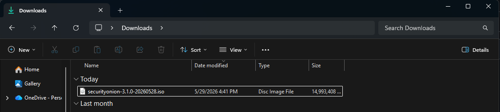
*The Security Onion 3.1.0 ISO in the Downloads folder.*

### Verify the ISO with SHA256

Never trust an ISO you have not verified. Verifying the SHA256 hash confirms the file downloaded completely and was not tampered with. Security Onion publishes the official MD5, SHA1, and SHA256 hashes on its download and verify page.

Open PowerShell and run:

```powershell
Get-FileHash "C:\Users\joshu\Downloads\securityonion-3.1.0-20260528.iso" -Algorithm SHA256
```

Compare the output to the official published SHA256 for this release:

```
62FAB57E247C843D6A04F0796D8162C732B65D82FC3E4A59D087135B9FD32912
```

If the two values match exactly, the ISO is good. If they differ, do not use the file, delete it and download again.

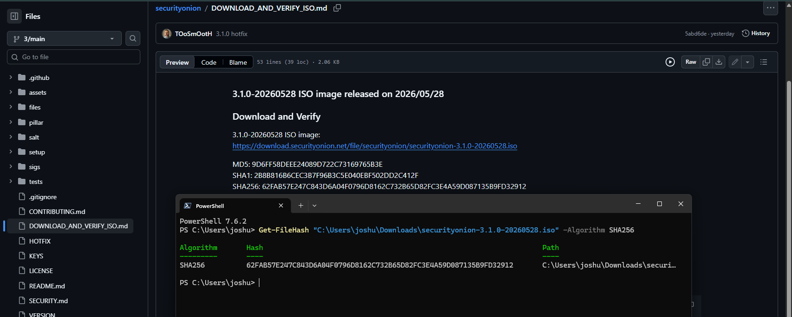
*The published SHA256 alongside the Get-FileHash output. The values match, confirming a valid ISO.*

> **Why this matters:** integrity verification is a core security habit. Skipping it is how supply-chain compromises slip through. Doing it by default, even in a lab, is exactly the discipline a SOC environment expects.

---

## Part 2: Boot the VM and install the base OS

### Power on and boot from the ISO

Select the `Security-Onion-SOC` VM in VMware and click **Power on this virtual machine**. Because the ISO is attached and set to connect at power on (Doc 02), the VM boots from it. Proceed with the default install entry at the boot menu.

### Confirm the disk wipe and create the admin account

The installer warns that all data on the disk will be destroyed. This is expected for a fresh VM. Type the full word `yes` to continue.

Next, the installer creates the operating system administrator account. Usernames must be lowercase and valid, so this build uses `socadmin`. Set a strong password when prompted. The password is not shown on screen as you type.

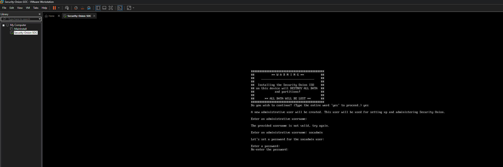
*Confirming the disk wipe with "yes" and creating the socadmin operating system account.*

> **Two accounts, do not confuse them.** The `socadmin` account created here is the **operating system** account, used for SSH and console administration. Later, the setup wizard creates a separate **web interface** account (an email and password) that you use to log in to https://192.168.0.50. They are different accounts for different purposes.

### Base OS installation

The installer now writes Oracle Linux Server 9.7 to disk, verifies packages, installs the boot loader, and performs post-installation setup. This takes several minutes.

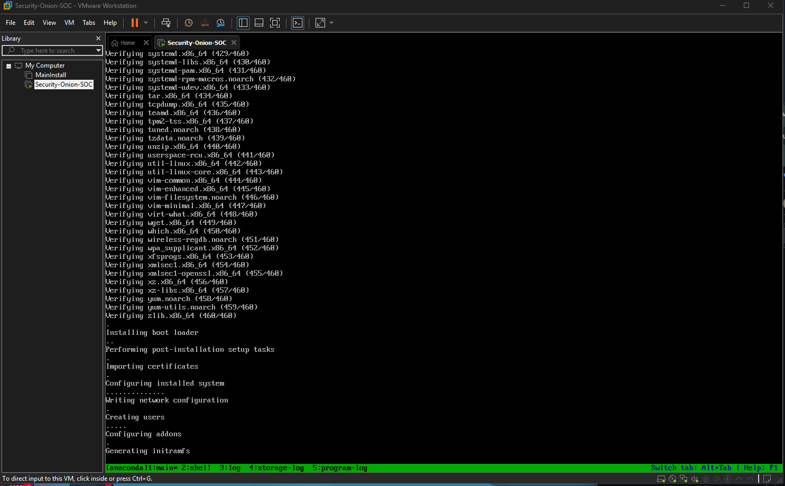
*The base operating system installing: verifying packages, installing the boot loader, creating users, and generating initramfs.*

### Reboot

When the base install finishes, you are prompted to reboot. Press Enter.

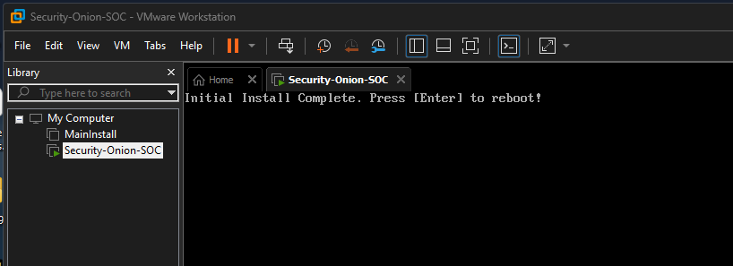
*Initial install complete. Press Enter to reboot into the new system.*

---

## Part 3: First boot and launch Security Onion Setup

### Log in as socadmin

After the reboot, the system boots from disk and presents a login banner. Note that it reads **Oracle Linux Server 9.7**, which is the real operating system underneath Security Onion. This is the actual OS referenced in Doc 01, and it is the reason the VMware guest type of "CentOS 8 64-bit" in Doc 02 was only a compatibility profile, not the installed system.

Log in with the `socadmin` username and the password you set.

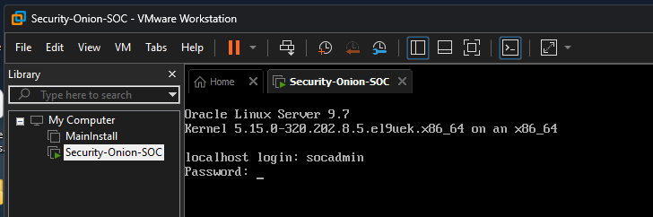
*First boot login. The banner confirms the base OS is Oracle Linux Server 9.7.*

### Start the setup wizard

The Security Onion Setup menu appears. Choose **Install** to run the standard installation. (The Configure Network option is only for adjusting networking on its own.)

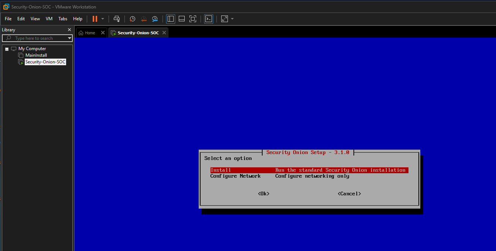
*The Security Onion Setup menu. Install runs the standard installation.*

The welcome screen explains that Setup uses keyboard navigation. Select **Yes** to continue.

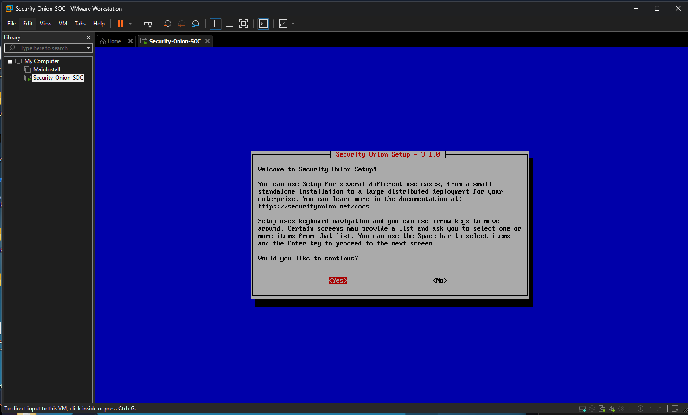
*The Security Onion Setup welcome screen.*

### Accept the license

Security Onion components are provided under the Elastic License version 2 (ELv2). Type `AGREE` to accept and continue.

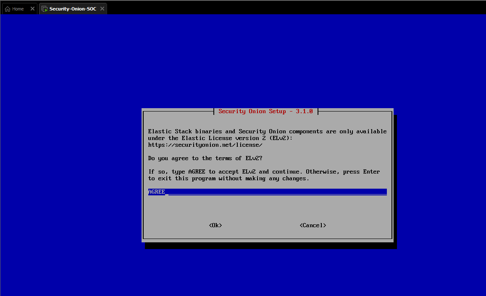
*Accepting the Elastic License v2 by typing AGREE.*

---

## Part 4: Installation type

### Standard (internet access)

The wizard asks how the node will be installed. Choose **Standard**, because this node has internet access. (Airgap is for isolated networks with no internet.)

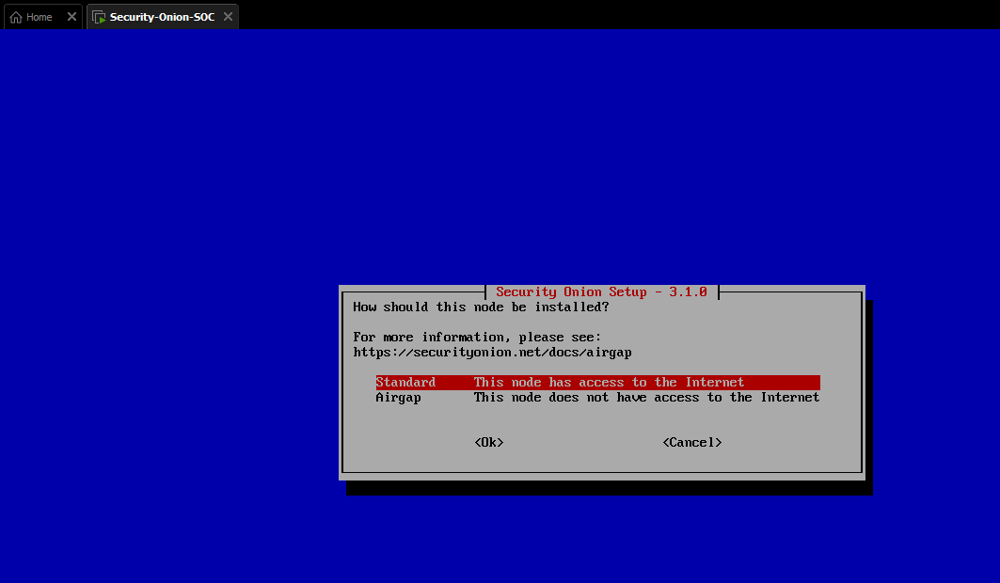
*Standard install selected, since this node has internet access.*

### Standalone production install

Choose **STANDALONE**, a standalone production install. This is a deliberate choice over EVAL (evaluation) mode. A standalone node runs the full production stack on a single machine, which is exactly what a real single-sensor deployment looks like, and it makes the lab a far stronger demonstration than evaluation mode would.

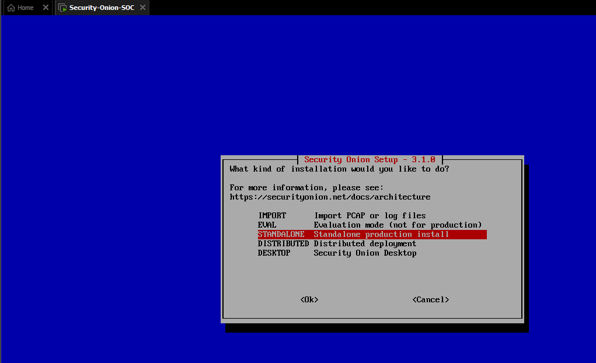
*STANDALONE selected, the production-grade single-node install.*

---

## Part 5: Hostname

### Set the hostname

Enter the hostname (not the fully qualified domain name). This build uses `securityonion`.

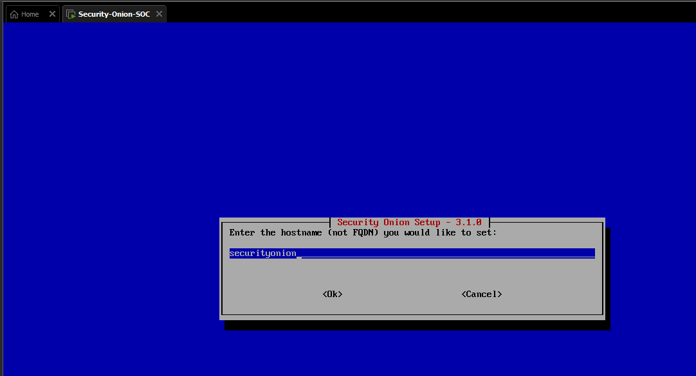
*Setting the hostname to securityonion.*

### Hostname warning

The wizard warns against using the default `securityonion` hostname in a distributed environment to avoid conflicts. This is a standalone node, not a distributed deployment, so there is no conflict to worry about. Choose **Use Anyway**.

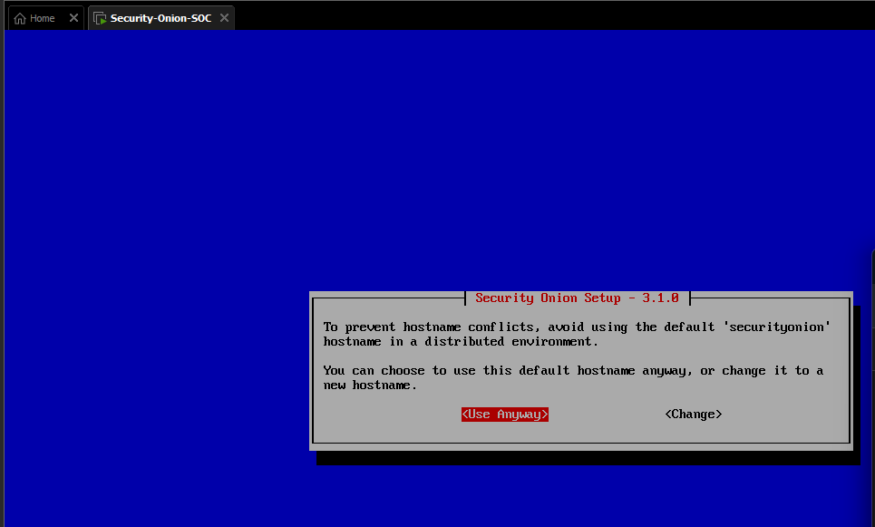
*The hostname warning applies to distributed setups. For a standalone node, Use Anyway is correct.*

---

## Part 6: Network configuration

### Select the management NIC

The wizard lists the available network interfaces and asks which to use for management. Select **ens160**, which is the bridged adapter configured in Doc 02. This is the interface that carries administration traffic and endpoint telemetry.

*(This screen is documented in text. It is not included in the repository because it displays the interface MAC addresses.)*

### Choose a static IP

Choose **STATIC**, the recommended option. A sensor should always have a predictable, fixed address so agents and analysts can reliably reach it.

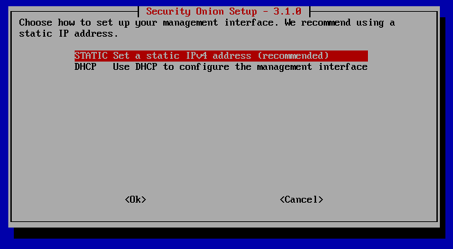
*STATIC selected for the management interface, the recommended choice for a sensor.*

### Enter the IP address

Enter the static IPv4 address in CIDR notation. This build uses **192.168.0.50/24**.

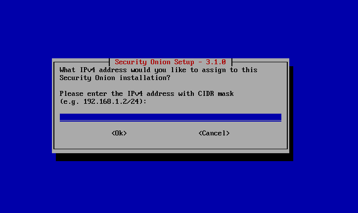
*Entering the static management IP, 192.168.0.50/24 for this build.*

### Enter the gateway

Enter the gateway address. This build uses **192.168.0.1**.

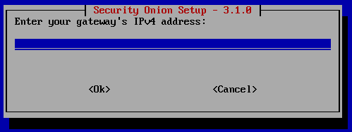
*Entering the gateway, 192.168.0.1.*

### Enter DNS servers

Enter the DNS servers separated by commas. This build uses **8.8.8.8,8.8.4.4** (Google Public DNS).

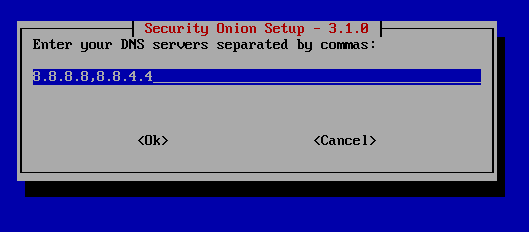
*DNS servers set to 8.8.8.8 and 8.8.4.4.*

### Enter the DNS search domain

Enter the DNS search domain. This build uses **securityonionsoc.local**.

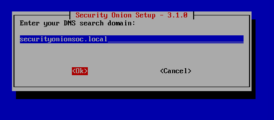
*DNS search domain set to securityonionsoc.local.*

### Select the monitor NIC

The wizard asks which interfaces to add to the monitor interface. Select **ens224**, the host-only adapter from Doc 02. This is the passive interface that Zeek and Suricata watch. (For why the monitor interface needs mirrored traffic to see endpoint packets, see the SPAN note in Doc 02.)

*(This screen is documented in text. It is not included in the repository because it displays the interface MAC address.)*

---

## Part 7: Access, accounts, and services

### Allowed analyst IP range

Enter a single IP address or a range, in CIDR notation, that is allowed to reach the sensor. This build uses **192.168.0.0/24** so any device on the home subnet can access the web interface.

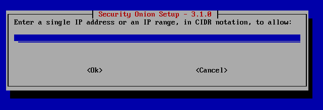
*Allowing the 192.168.0.0/24 range so devices on the home subnet can reach the interface.*

### Docker IP range

The wizard asks whether to keep the default Docker IP range. Unless that range conflicts with your network, keep the default. Choose **Yes**.

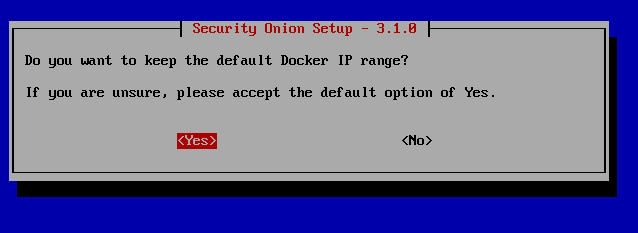
*Keeping the default Docker IP range.*

### Web access method

Choose how you will reach the web interface. Whatever you pick here becomes the only way to access it. Choose **IP**, which is why this build's interface lives at https://192.168.0.50. (Hostname or FQDN options require working DNS resolution.)

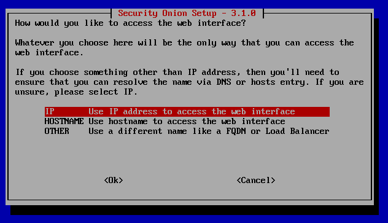
*IP selected as the web access method.*

### Create the web interface admin account

The wizard prompts for the email address and password that become your Security Onion **web interface** login (separate from the `socadmin` OS account). Enter your email and a strong password.

*(This screen is documented in text. It is not included in the repository because it displays a real email address.)*

### Enable web interface access

Confirm that you want to allow access to the installation via the web interface. Choose **Yes**.

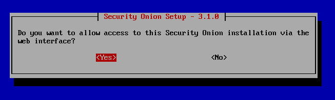
*Enabling web interface access.*

### Internet connection method

Choose how the node connects to the internet for updates and components. Choose **Direct**, since this node connects straight to the internet without a proxy.

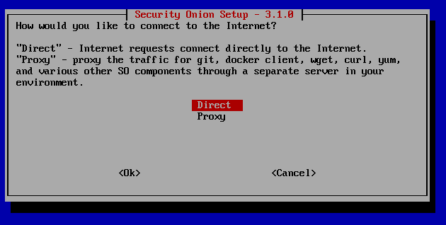
*Direct internet connection selected (no proxy).*

### Node description

Enter a short description for the node. This build uses **Home SOC Standalone Node**.

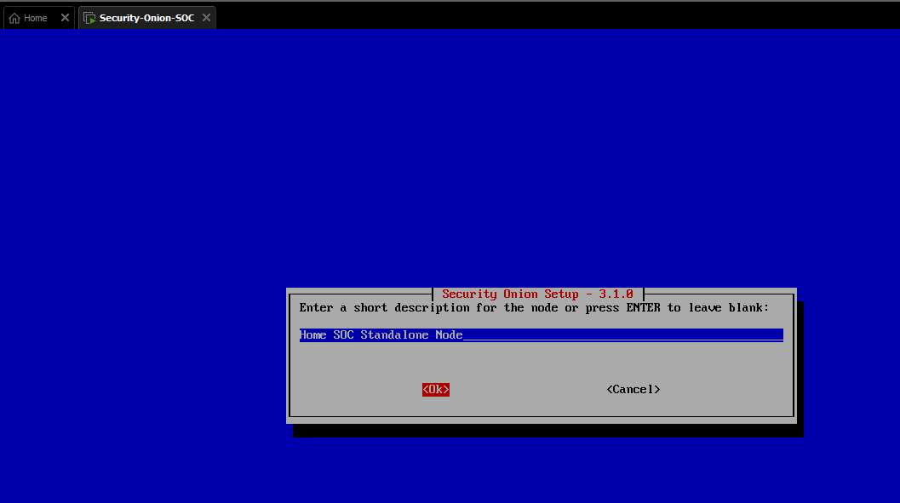
*Node description set to Home SOC Standalone Node.*

### SOC telemetry

The wizard asks whether to enable SOC Telemetry, which helps the Security Onion team understand feature usage. This build chooses **Yes** to support the project. This is optional and can be changed later in the SOC Configuration screen.

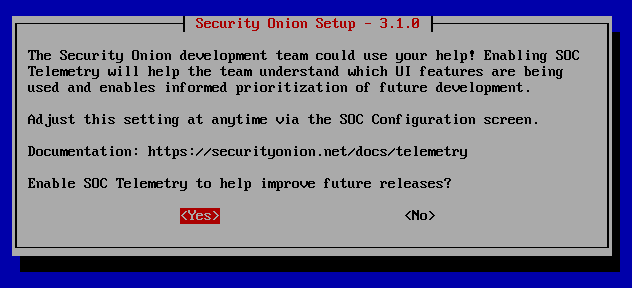
*SOC Telemetry enabled to help improve future releases.*

---

## Part 8: Run the installation

### Confirm the final configuration summary

The wizard displays a summary of every choice made above and asks for final confirmation before it begins. Review it carefully, then confirm to proceed.

*(This summary screen is documented in text. It is not included in the repository because it restates the admin email and other configuration details.)*

### Installation runs

Security Onion now installs and configures itself using SaltStack. It sets up Docker, the Elastic Stack, Zeek, Suricata, the firewall, and all supporting services. This is the longest step and can take a while.

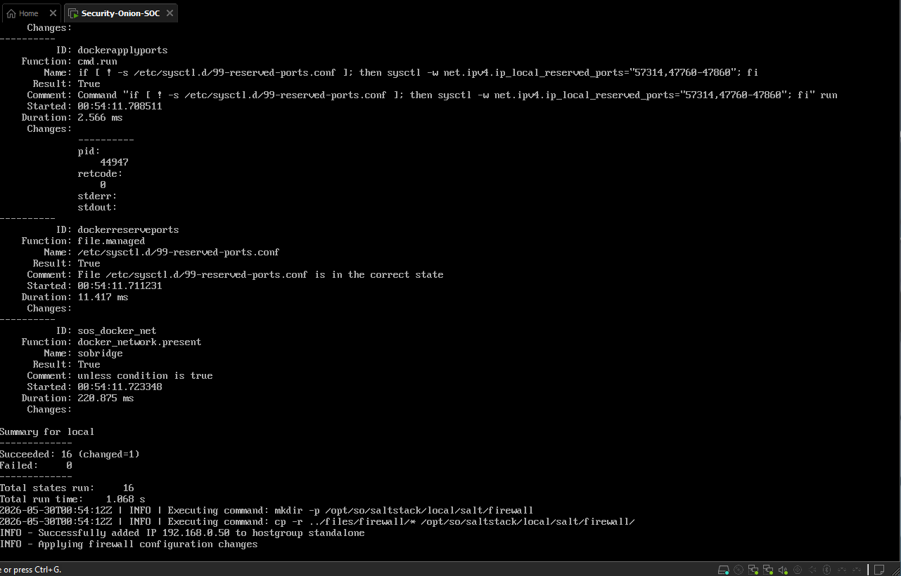
*SaltStack applying the configuration, including adding 192.168.0.50 to the standalone firewall hostgroup.*

When the install finishes, the wizard reports that setup is complete.

*(The final "setup complete" screen is documented in text and not included in the repository.)*

---

## Part 9: Access the web interface

### Browse to the sensor and accept the certificate warning

On the desktop, open a browser and go to:

```
https://192.168.0.50
```

The browser shows a "Your connection is not private" warning with `NET::ERR_CERT_AUTHORITY_INVALID`. This is completely expected. Security Onion uses a self-signed TLS certificate, which browsers do not recognize by default. It is not a real security problem on your own lab sensor. Click **Advanced**, then proceed to the site.

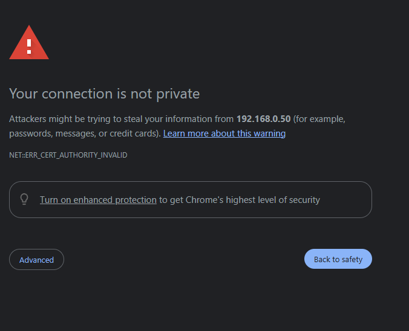
*The expected self-signed certificate warning. Click Advanced and proceed.*

### Log in

The Security Onion login page loads. Sign in with the **web interface** email and password you created during the wizard (not the socadmin OS account).

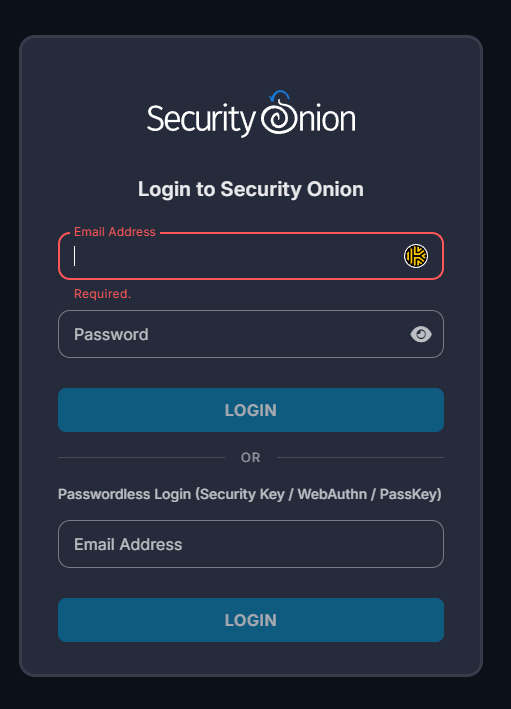
*The Security Onion login page.*

### The interface is live

You land on the Overview page. The left navigation shows Alerts, Dashboards, Hunt, Cases, Detections, PCAP, Grid, and direct links to tools like Kibana, Elastic Fleet, and CyberChef. The footer confirms **Version 3.1.0**. Security Onion is installed and running.


*The Security Onion web interface, live and running version 3.1.0.*

---

## Verification

Confirm the following before moving on:

- [ ] The ISO SHA256 matched the published value before install
- [ ] The base OS login banner reads Oracle Linux Server 9.7
- [ ] You can browse to https://192.168.0.50 and reach the login page
- [ ] You can log in to the web interface with the admin email account
- [ ] The Overview page footer shows Version 3.1.0

Optional command-line health check, run over SSH or at the console as `socadmin`:

```bash
sudo so-status
```

This lists the Security Onion services and their status. It is normal for services to take a few minutes to all report healthy after a fresh install.

> **Keeping Security Onion updated:** always update Security Onion using the `sudo soup` command. Do not update components by other means. This is the supported upgrade path and it keeps the whole stack in sync.

---

## Troubleshooting

### "Your connection is not private" when opening the web interface

This is not an error to fix, it is expected behavior. Security Onion presents a self-signed certificate that browsers do not trust by default. Click **Advanced** and proceed to the site. The warning does not indicate a compromised connection on your own lab sensor.

### The web interface is unreachable at 192.168.0.50

If the page will not load at all, confirm the device you are browsing from is on the 192.168.0.0/24 subnet (the main router, not the Google Nest, per Doc 01) and that the sensor finished installing. A device on a different subnet cannot reach 192.168.0.50.

---

## How this maps to MITRE ATT&CK

This install stands up the platform that makes MITRE ATT&CK detection possible at all. Security Onion bundles the data sources and analysis tooling that map to ATT&CK:

- **Elastic Stack** stores and searches the endpoint and network telemetry that ATT&CK techniques are detected from.
- **Zeek** produces protocol and connection logs (network data sources) used to spot command and control, discovery, and lateral movement.
- **Suricata** provides signature-based intrusion detection on the monitor interface.
- **The Hunt and Alerts interfaces** are where detection and triage happen, the Detection and Analysis phase of the incident response lifecycle.

With the platform live, the next phase brings a real endpoint online to generate the telemetry this sensor will collect and, later, the adversary behavior it will detect.

---

## What's Next

The sensor is installed and the web interface is live. The next phase builds the Windows 11 endpoint VM on the laptop that will become the monitored system.

➡️ Continue to [04 - Endpoint VM Setup](04-endpoint-vm-setup.md)
