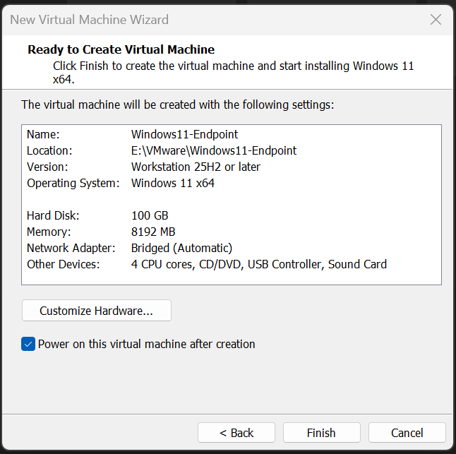

# 04 - Endpoint VM Setup

## Overview

This document builds the Windows 11 endpoint that the Security Onion sensor will monitor. If the sensor from Doc 03 is the watchtower, this VM is the building being watched. It is the system where, in later phases, normal Windows activity and simulated adversary behavior will generate the telemetry that flows into the SOC.

This phase creates the VM, installs Windows 11, adds VMware Tools and PowerShell 7, and establishes the snapshot strategy that keeps the lab safe to run destructive tests against. The detection tooling itself (Sysmon and the Elastic Agent) is installed in the next two documents.

Most of this phase was not heavily screenshotted, so several steps are documented in text. The one captured screen, the VM creation summary, is included.

---

## Objectives

By the end of this phase you will have:

- A Windows 11 Enterprise Evaluation VM named `Windows11-Endpoint` on the laptop
- VMware Tools installed for stable display and integration
- PowerShell 7.6.2 installed
- A clean baseline snapshot and a clear snapshot strategy for the rest of the build

### Where this fits in the incident response lifecycle

This is still **Preparation**. The endpoint is the monitored asset. In a real environment, this is the kind of workstation a SOC protects and the place where adversary techniques actually execute. Standing it up cleanly, with snapshots in place, is what makes the later detection and attack-simulation work both possible and repeatable.

---

## Prerequisites

- The laptop with VMware Workstation Pro 26H1 installed
- The laptop on the main router WiFi, not the Google Nest (see Doc 01), so the VM can reach the sensor later
- The Windows 11 Enterprise Evaluation ISO (free 90-day, rearmable, from the Microsoft Evaluation Center)
- Free space on the 2 TB Samsung 990 Pro (E:) drive for the VM

---

## Part 1: Create the Windows 11 VM

In VMware Workstation Pro, go to **File > New Virtual Machine** and run the wizard:

1. Choose to install from the **installer disc image file (ISO)** and select the Windows 11 Enterprise Evaluation ISO.
2. Guest operating system: **Windows 11 x64**.
3. Virtual machine name: `Windows11-Endpoint`.
4. Location: `E:\VMware\Windows11-Endpoint` (on the dedicated VM drive).
5. Disk size: **100 GB**.
6. Customize hardware: set memory to **8 GB (8192 MB)** and processors to **4 cores**.
7. Network adapter: **Bridged (Automatic)**, so the VM appears on the home subnet (192.168.0.0/24) with its own DHCP address.

> **Windows 11 requirements:** Windows 11 requires TPM 2.0 and Secure Boot. VMware Workstation Pro supports running Windows 11 as a guest and provides the necessary virtual firmware for it. If the wizard prompts about encryption or a TPM for the Windows 11 guest, accept it so the install can proceed.

Review the summary and click **Finish**. With "Power on this virtual machine after creation" checked, the VM boots straight into the Windows 11 installer.


*The endpoint VM summary: Windows11-Endpoint, 100 GB disk, 8192 MB RAM, 4 CPU cores, Bridged networking.*

---

## Part 2: Install Windows 11

The VM boots into Windows Setup. Walk through the standard installation:

1. Select language, time, and keyboard, then continue.
2. When prompted for the edition, choose **Windows 11 Enterprise Evaluation**.
3. Accept the license terms.
4. Choose a **Custom** install and select the 100 GB virtual disk.
5. Let the installation complete and reboot into the Windows out-of-box experience (OOBE).
6. Set region and keyboard, then create a **local administrator account**. This build uses the username `socadmin` to keep naming consistent with the sensor. These are entirely separate accounts on separate machines, the matching name is just for convenience.

Windows assigns a default computer name during setup. This build's endpoint is **DESKTOP-N063J06**, which is the hostname that will later appear in Security Onion's Fleet and in Kibana, so it is worth noting now.

---

## Part 3: Install VMware Tools

VMware Tools improves display scaling, mouse handling, shared clipboard, and overall performance, and it is recommended for any guest.

1. With the VM running, in VMware go to **VM > Install VMware Tools**. This mounts the VMware Tools installer as a virtual CD inside the guest.
2. In Windows, open File Explorer, open the mounted CD drive, and run **setup64.exe**.
3. Complete the installer with the default (Typical) options.
4. Reboot the VM.

After the reboot, the display should scale correctly to the VMware window and the shared clipboard should work.

---

## Part 4: Install PowerShell 7

Windows ships with Windows PowerShell 5.1, but this build uses the modern PowerShell 7 for scripting and for running attack simulations later. Install it with winget, the built-in Windows package manager.

Open Windows PowerShell (5.1) or Windows Terminal and run:

```powershell
winget install --id Microsoft.PowerShell --source winget
```

This build installs **PowerShell 7.6.2**. Once it finishes, open the new PowerShell 7 (the executable is `pwsh`) and confirm the version:

```powershell
pwsh --version
```

A PowerShell 7 profile is also configured (the profile path is shown by running `$PROFILE`). The profile is later used to auto-load the attack-simulation module, which is covered in Doc 08.

---

## Part 5: Snapshot strategy

Snapshots are one of the most important habits in this entire build. A snapshot captures the exact state of the VM at a moment in time, so you can roll back to it instantly. This matters enormously in an attack-simulation lab, because the tests you run later deliberately execute malicious-like behavior. Snapshots let you return the endpoint to a known-clean state after each test.

This build takes a snapshot at every major milestone, creating a clear, reversible timeline:

| Order | Snapshot | Taken when | Documented in |
|---|---|---|---|
| 1 | Clean Baseline | Windows, VMware Tools, and PowerShell 7 are installed, before any monitoring tooling | This document |
| 2 | Sysmon Installed | After Sysmon and the SwiftOnSecurity config are in place | Doc 05 |
| 3 | Atomic Red Team Installed | After the attack-simulation framework is installed | Doc 08 |
| 4 | SO Hunt - Windows11 Endpoint Sysmon | After the Elastic Agent is enrolled and the pipeline is verified | Doc 07 |

> **Golden rule:** always take a snapshot **before** running any attack simulation, so you can revert the endpoint afterward. This is reinforced throughout the attack-simulation work in Doc 08.

### Take the Clean Baseline snapshot

With Windows, VMware Tools, and PowerShell 7 installed and the VM in a pristine state, take the first snapshot now:

1. In VMware, go to **VM > Snapshot > Take Snapshot**.
2. Name it `Clean Baseline`.
3. Add a short description, for example "Fresh Windows 11 with VMware Tools and PowerShell 7, no monitoring tooling yet."
4. Click **Take Snapshot**.

This is your clean fallback point for the rest of the build.

---

## Verification

Confirm the following before moving on:

- [ ] The Windows11-Endpoint VM boots into Windows 11
- [ ] VMware Tools is installed (display scales to the window, shared clipboard works)
- [ ] PowerShell 7.6.2 is installed (`pwsh --version` confirms it)
- [ ] The VM has a 192.168.0.x address from the main router's DHCP
- [ ] A Clean Baseline snapshot exists in VM > Snapshot > Snapshot Manager

---

## Troubleshooting

### Extending the 90-day evaluation

Windows 11 Enterprise Evaluation runs for 90 days. If the lab is still in use near that limit, the evaluation period can be reset (rearmed). From an elevated PowerShell or Command Prompt inside the VM:

```powershell
slmgr /rearm
```

Reboot afterward. This buys another evaluation period and keeps the lab running without rebuilding.

### The VM gets the wrong network or cannot reach the sensor later

The VM must be on the 192.168.0.0/24 subnet to reach the sensor at 192.168.0.50. Confirm the laptop is connected to the main router and not the Google Nest (see Doc 01), then verify the VM pulled a 192.168.0.x address. A device on the Nest's separate subnet cannot reach the sensor.

---

## How this maps to MITRE ATT&CK

The endpoint is the stage on which ATT&CK techniques play out. In a real environment, this is where Execution, Persistence, Privilege Escalation, and Credential Access techniques would run. Right now the VM only generates ordinary Windows activity, but once Sysmon (Doc 05) and the Elastic Agent (Doc 06) are added, it becomes a rich source of the host data that ATT&CK detections depend on, things like process creation, command-line arguments, and authentication events. Building it cleanly and snapshotting it is the Preparation that makes the later Detection and Analysis work trustworthy and repeatable.

---

## What's Next

The endpoint exists and is clean. The next phase installs Sysmon with the SwiftOnSecurity configuration to turn this ordinary Windows VM into a detailed telemetry source.

➡️ Continue to [05 - Sysmon Configuration](05-sysmon-configuration.md)
