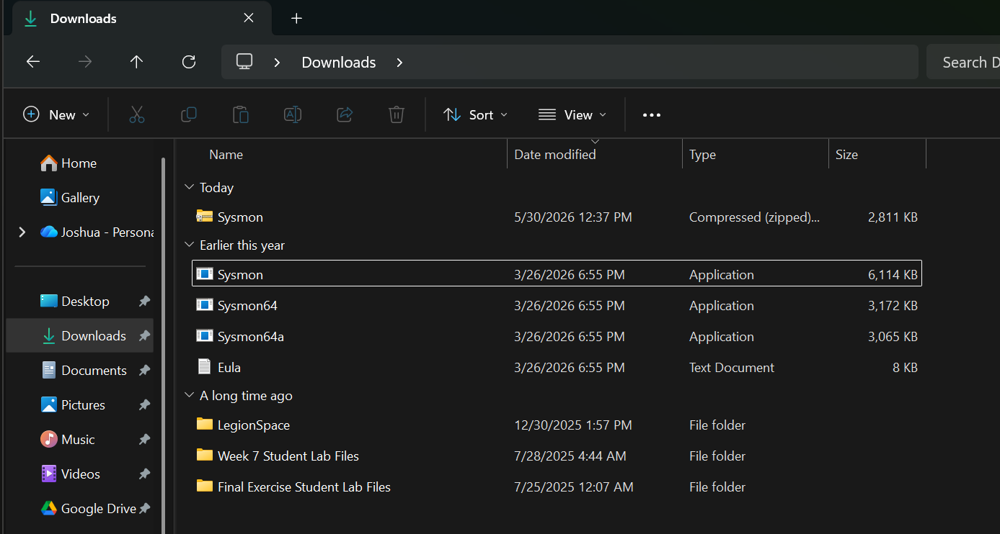
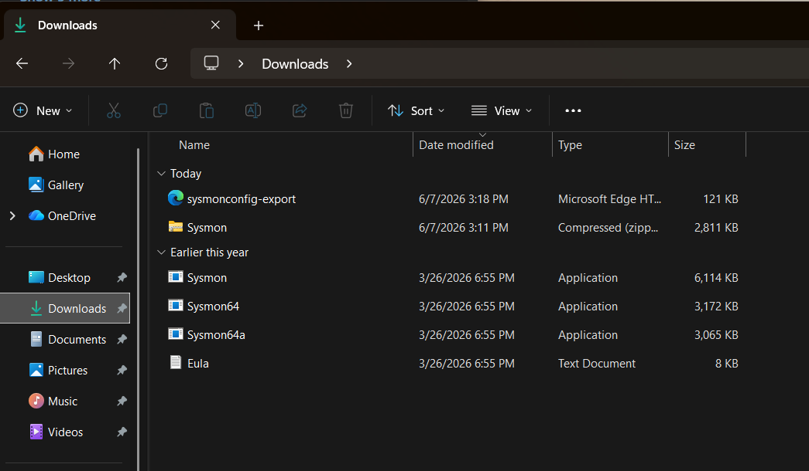
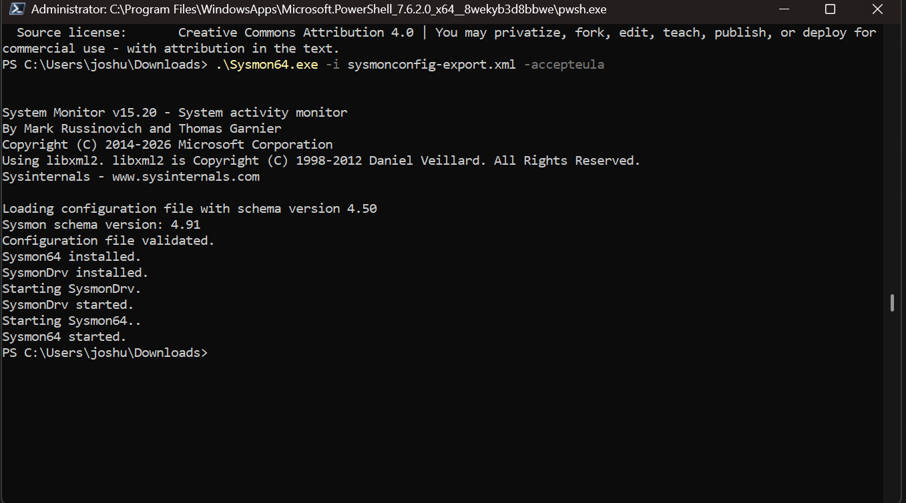
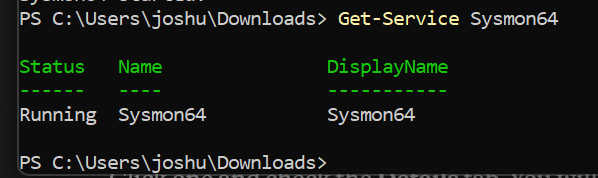
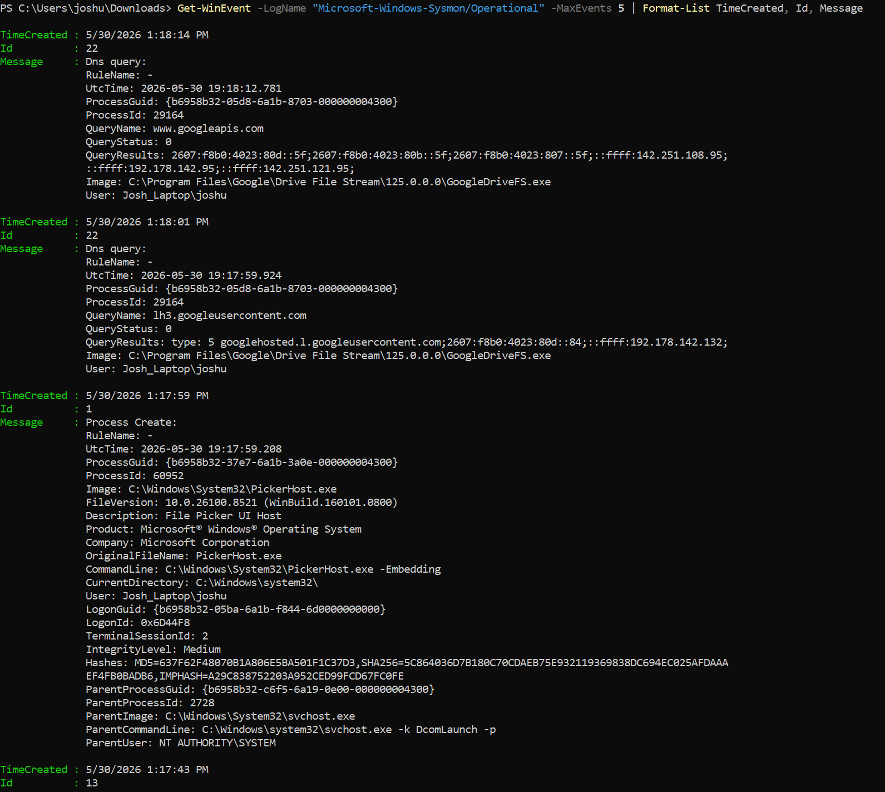
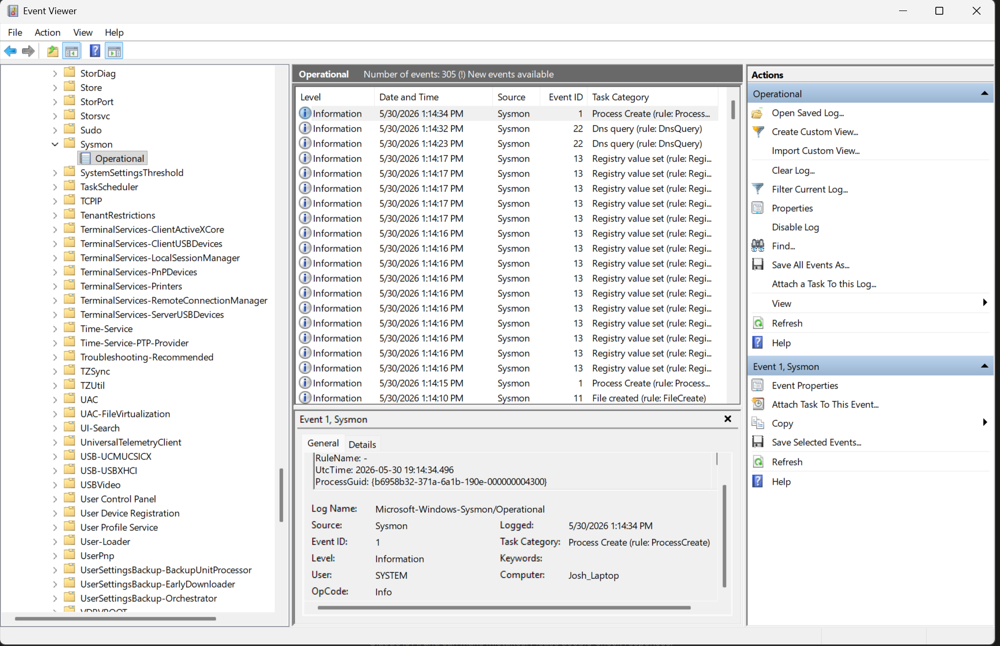

# 05 - Sysmon Configuration

## Overview

Out of the box, Windows logs very little of the detail a SOC needs. Sysmon (System Monitor) fixes that. It is a Sysinternals tool, a Windows service plus a kernel driver, that records high-fidelity, security-relevant events to the Windows event log: every process creation with its full command line and file hashes, network connections, DNS queries, registry changes, file creation, image loads, and more. It logs from boot and persists across reboots.

This document installs Sysmon v15.20 with the SwiftOnSecurity configuration on the `Windows11-Endpoint` VM, verifies that the service is running and logging, and provides a Sysmon Event ID reference for the analysis work later. After this phase, the endpoint is a rich telemetry source. It is still logging only locally at this point. Shipping those events to Security Onion happens in Doc 06.

---

## Objectives

By the end of this phase you will have:

- Sysmon v15.20 installed on the endpoint with the SwiftOnSecurity config
- The `Sysmon64` service running and logging to the `Microsoft-Windows-Sysmon/Operational` log
- Confirmation that events are being generated on DESKTOP-N063J06
- A `Sysmon Installed` snapshot and an Event ID reference for later analysis

### Where this fits in the incident response lifecycle

This is **Preparation**, specifically building visibility. Sysmon is the single most important endpoint telemetry source in this build. Detection and Analysis later in the lifecycle are only as good as the data feeding them, and Sysmon is most of that data on the endpoint side.

---

## Why Sysmon, and why the SwiftOnSecurity config

**Sysmon** turns sparse default Windows logging into detailed, structured telemetry. The standout is process creation logging (Event ID 1), which records the full command line, the file hashes, the parent process, the user, and the integrity level for every process that starts. That single event type powers a huge share of real-world detections.

**The configuration controls what Sysmon logs and what it filters out.** Writing a good Sysmon config from scratch is genuinely hard, getting the signal without drowning in noise takes real expertise. The **SwiftOnSecurity sysmon-config** is a widely used, community-maintained baseline that captures high-value events while filtering common noise. It is a respected industry starting point, which is exactly why this build uses it rather than reinventing the wheel.

---

## Prerequisites

- The `Windows11-Endpoint` VM from Doc 04, sitting at the Clean Baseline snapshot
- PowerShell 7 installed (Doc 04)
- Administrator access inside the VM
- Internet access in the VM (main router, see Doc 01)

---

## Step 1: Download and extract Sysmon

Inside the VM, download Sysmon from the official Sysinternals page at https://learn.microsoft.com/en-us/sysinternals/downloads/sysmon. Extract `Sysmon.zip` into the Downloads folder. You get four files: `Sysmon.exe` (32-bit), `Sysmon64.exe` (64-bit), `Sysmon64a.exe` (ARM64), and `Eula.txt`. On 64-bit Windows 11, you use `Sysmon64.exe`.


*The extracted Sysmon binaries. Sysmon64.exe is the one used on 64-bit Windows 11.*

---

## Step 2: Download the SwiftOnSecurity config

Download the config into the same folder as the Sysmon binaries. Using PowerShell to download it guarantees the file is saved with a proper `.xml` extension:

```powershell
cd $env:USERPROFILE\Downloads
Invoke-WebRequest -Uri "https://raw.githubusercontent.com/SwiftOnSecurity/sysmon-config/master/sysmonconfig-export.xml" -OutFile "sysmonconfig-export.xml"
```

Keeping `sysmonconfig-export.xml` in the same folder as `Sysmon64.exe` means the install command can reference the config by filename without a full path.


*sysmonconfig-export.xml downloaded into the same folder as the Sysmon binaries.*

---

## Step 3: Install Sysmon with the config

Open **PowerShell 7 as Administrator** (Sysmon installs a driver, so it requires elevation). Navigate to Downloads and run the install:

```powershell
cd $env:USERPROFILE\Downloads
.\Sysmon64.exe -i sysmonconfig-export.xml -accepteula
```

The flags:
- `-i sysmonconfig-export.xml` installs Sysmon and applies the named config
- `-accepteula` accepts the license non-interactively

The output confirms the install. Note one detail worth understanding: the config loads with **schema version 4.50** while Sysmon itself reports **schema version 4.91**. That is expected. The SwiftOnSecurity config is written against schema 4.50, and Sysmon v15.20 (which supports up to 4.91) validates and accepts it without issue.


*The install running as socadmin: config validated, Sysmon64 and SysmonDrv installed and started.*

---

## Step 4: Verify the service is running

Confirm the Sysmon service is up:

```powershell
Get-Service Sysmon64
```

It should report **Status: Running**.


*The Sysmon64 service running.*

---

## Step 5: Verify events are being logged

Sysmon writes to its own event log. Pull the most recent events to confirm it is capturing activity:

```powershell
Get-WinEvent -LogName "Microsoft-Windows-Sysmon/Operational" -MaxEvents 5 | Format-List TimeCreated, Id, Message
```

Two things to notice in the output. First, the **User** field reads `DESKTOP-N063J06\socadmin`, confirming these are events from the endpoint VM. Second, look at the depth of a Process Create event (Event ID 1): it includes the full `Image` path, the complete `CommandLine`, file `Hashes` (MD5, SHA256, IMPHASH), the `ParentImage`, the `IntegrityLevel`, and the `User`. That level of detail is exactly what makes Sysmon so valuable for detection.


*Recent Sysmon events on DESKTOP-N063J06, showing the rich fields captured per event.*

---

## Step 6: Verify in Event Viewer

For a visual confirmation, open Event Viewer (`Win+R`, type `eventvwr`) and browse to:

**Applications and Services Logs > Microsoft > Windows > Sysmon > Operational**

Click any event and confirm the **Computer** field in the detail pane reads **DESKTOP-N063J06**. The event count also shows the log is actively filling, this build was already past 7,000 events, which reflects a healthy, continuously logging endpoint.


*The Sysmon Operational log in Event Viewer, Computer field confirming DESKTOP-N063J06.*

---

## Step 7: Take the "Sysmon Installed" snapshot

With Sysmon installed and verified, take the second snapshot in the timeline from Doc 04:

1. In VMware, go to **VM > Snapshot > Take Snapshot**.
2. Name it `Sysmon Installed`.
3. Add a short description, for example "Windows 11 with Sysmon v15.20 and SwiftOnSecurity config, logging confirmed."

---

## Sysmon Event ID reference

These are the high-value Sysmon event types and why they matter for detection. The ones in bold are directly relevant to this build's Phase 3 attack simulations.

| Event ID | Event | What it captures | Why it matters for detection |
|---|---|---|---|
| **1** | Process Create | Full command line, file hashes, parent process, user, integrity level | The workhorse event. Catches PowerShell execution, suspicious child processes, and living-off-the-land binaries |
| 3 | Network Connection | Source and destination IP and port, the process responsible | Command and control, exfiltration, lateral movement |
| 5 | Process Terminated | Process exit | Timeline reconstruction, short-lived process detection |
| 7 | Image Loaded | DLLs loaded by a process | DLL side-loading and injection |
| 8 | CreateRemoteThread | Thread creation in another process | Process injection |
| **10** | Process Access | One process opening a handle to another | Credential dumping (access to lsass.exe) |
| 11 | File Created | New files written to disk | Dropped payloads and persistence artifacts |
| 12, 13, 14 | Registry Events | Registry key and value create, set, delete, rename | Persistence (Run keys) and defense evasion |
| 22 | DNS Query | DNS lookups by process | Command and control domains and DNS-based exfiltration |

The SwiftOnSecurity config enables these (and more) with tuned filtering, so the noisiest, least useful events are suppressed while the high-signal ones come through.

---

## Verification

Confirm the following before moving on:

- [ ] Sysmon v15.20 installed (install output ended with "Sysmon64 started.")
- [ ] `Get-Service Sysmon64` shows Running
- [ ] The `Microsoft-Windows-Sysmon/Operational` log is filling with events
- [ ] Event Viewer shows Computer: DESKTOP-N063J06
- [ ] A `Sysmon Installed` snapshot exists

---

## Troubleshooting

### Reinstalling Sysmon fails with a file-lock or manifest error

If you ever uninstall and reinstall Sysmon (for example, to re-apply the config or capture a clean install), you may hit a chain of confusing errors. This build ran into exactly this, and here is the real fix.

**Symptom 1, during uninstall (`.\Sysmon64.exe -u`):**
```
Failed to delete C:\WINDOWS\Sysmon64.exe
```
This is harmless on its own. The lines above it confirm the services and driver were removed (`Sysmon64 removed`, `SysmonDrv removed`). The only thing left behind is the binary file, which had a momentary lock.

**Symptom 2, on the immediate reinstall:**
```
Error copying sysmon in systemroot:
The process cannot access the file because it is being used by another process.
```
The locked binary in `C:\WINDOWS` is blocking the copy.

**Symptom 3, after a reboot, the reinstall may still fail:**
```
wevtutil.exe returned failure
Event manifest installation failed with last error:
The operation completed successfully.
```
This misleading message means the old Sysmon event manifest was still registered and conflicted with the new one. A follow-up `Get-Service Sysmon64` returns "Cannot find any service," confirming the service did not get created.

**The fix:**
1. Reboot the VM to release the file lock.
2. After the reboot, run the uninstall and install back to back:
   ```powershell
   .\Sysmon64.exe -u
   .\Sysmon64.exe -i sysmonconfig-export.xml -accepteula
   ```
   The uninstall may report "Sysmon is not installed on this computer," which is fine. Running it clears any stale manifest state, and the install immediately after completes cleanly, ending with "Sysmon64 started."

The root cause is simple: Sysmon's binary and event manifest can linger after an uninstall, and a reboot plus a clean uninstall-then-install cycle resolves it.

### Updating the config later without reinstalling

To apply a new or edited config without a full reinstall:

```powershell
.\Sysmon64.exe -c sysmonconfig-export.xml
```

---

## How this maps to MITRE ATT&CK

Sysmon is the data source behind a large share of ATT&CK detections, and it directly enables this build's Phase 3 simulations:

- **T1059.001 PowerShell Execution** is caught by Event ID 1 (Process Create), which records `powershell.exe` or `pwsh.exe` along with the full command line.
- **T1003 OS Credential Dumping** is caught by Event ID 10 (Process Access), which records a process opening a handle to `lsass.exe`.
- **T1078 Valid Accounts** is detected primarily through Windows Security logon events, with Sysmon process context adding the surrounding story.

More broadly, Event ID 1 (command line), Event ID 3 (network), Event ID 22 (DNS), and the registry events give coverage across Execution, Command and Control, Persistence, and Defense Evasion. This is the visibility that makes the Detection and Analysis work in later phases meaningful.

---

## What's Next

Sysmon is logging in detail, but only locally. The endpoint is not yet sending anything to the SOC. The next phase installs the Elastic Agent and enrolls it in Security Onion's Fleet, so these Sysmon events flow into Elasticsearch and become searchable and alertable in the SOC.

➡️ Continue to [06 - Elastic Agent Setup](06-elastic-agent-setup.md)
