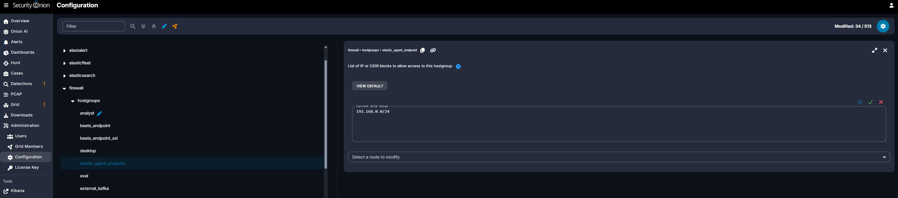
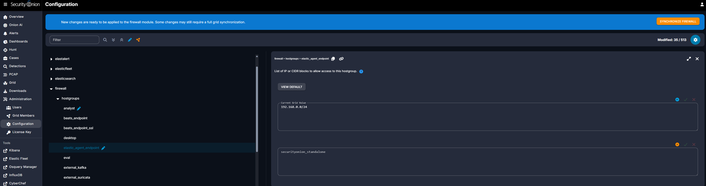
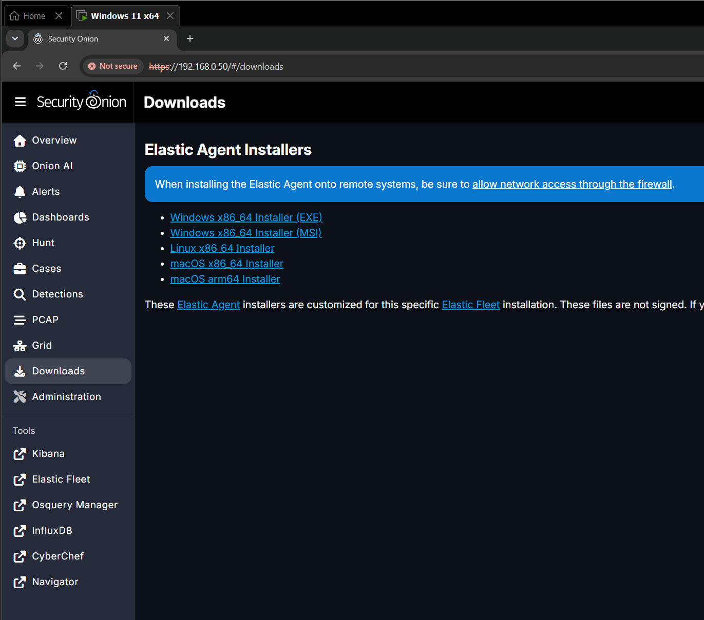
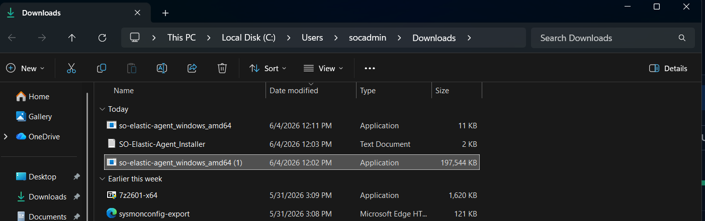
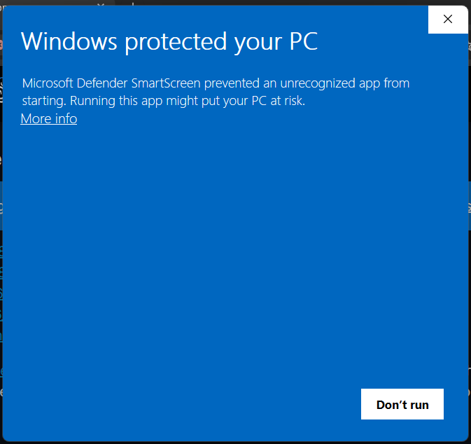
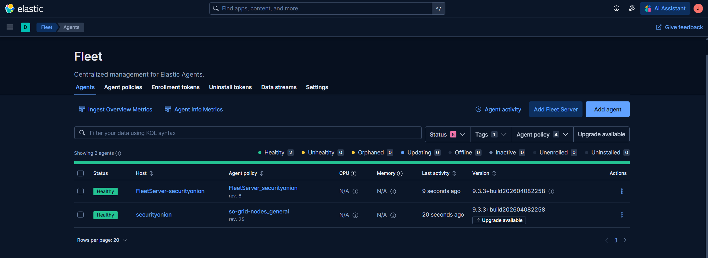

# 06 - Elastic Agent Setup

## Overview

So far the endpoint generates rich Sysmon telemetry, but it all stays local on the Windows VM. This document closes the loop. The Elastic Agent is the piece that ships the endpoint's logs (Sysmon events, Windows security and application logs) to Security Onion, where they land in Elasticsearch and become searchable in Kibana, the Hunt view, and the Alerts view.

In Security Onion, agents are managed centrally through **Elastic Fleet**. This phase opens the Security Onion firewall to the endpoint, downloads the Fleet-managed agent installer, runs it to enroll the endpoint, and verifies the agent shows up Healthy in Fleet.

After this phase, the full telemetry pipeline from endpoint to SOC is live. Verifying that pipeline end to end is the focus of Doc 07.

---

## Objectives

By the end of this phase you will have:

- The Security Onion firewall configured to allow the endpoint subnet to reach Fleet
- The Elastic Agent installed on `DESKTOP-N063J06`
- The endpoint enrolled in Fleet on the `endpoints-initial` policy, showing **Healthy**
- A clear understanding of why you must never manually upgrade agents through Fleet

### Where this fits in the incident response lifecycle

This is the final piece of **Preparation**. The Elastic Agent is the transport that makes Detection and Analysis possible. A sensor with no data flowing into it cannot detect anything. With the agent enrolled and healthy, the SOC finally has eyes on the endpoint.

---

## How agent management works in Security Onion

This is worth understanding before you start, because it differs from a standard Elastic deployment.

In Security Onion, you do not install a generic Elastic Agent and manually paste in a Fleet URL and enrollment token. Instead, the Security Onion web interface generates an installer that is **customized for your specific Fleet installation**. The Fleet server address and the enrollment token are already baked into the installer. You download it, run it, and the endpoint enrolls itself automatically. This is a deliberate Security Onion convenience that removes a whole class of manual configuration errors.

---

## Prerequisites

- The `Windows11-Endpoint` VM with Sysmon installed and logging (Doc 05)
- The endpoint on the 192.168.0.0/24 subnet, reachable to the sensor at 192.168.0.50 (main router, not the Google Nest, see Doc 01)
- Administrator access in the VM
- Access to the Security Onion web interface at https://192.168.0.50

---

## Part 1: Allow the endpoint through the Security Onion firewall

By default, Security Onion's firewall restricts which systems can connect to the agent endpoint. The endpoint must be explicitly allowed, or enrollment will fail to reach the server. The Downloads page even reminds you of this directly: "When installing the Elastic Agent onto remote systems, be sure to allow network access through the firewall."

In the Security Onion web interface, open **Configuration** from the left menu, then expand the configuration tree to:

**firewall > hostgroups > elastic_agent_endpoint**

Set the **Current Grid Value** to your endpoint subnet, `192.168.0.0/24`, applied to the `securityonion_standalone` node. This is the list of IP or CIDR blocks allowed to reach this hostgroup.


*The elastic_agent_endpoint hostgroup set to allow 192.168.0.0/24.*

After saving the value, a banner appears noting that new changes are ready to apply. Click **SYNCHRONIZE FIREWALL** to push the change to the node.


*The change applied to the securityonion_standalone node, ready to commit with SYNCHRONIZE FIREWALL.*

> **Why this matters:** this is the same subnet logic from Doc 01. The endpoint can only reach the sensor if it is on 192.168.0.0/24, and the firewall must explicitly allow that range. If the endpoint were on the Google Nest's separate subnet, no firewall rule would help, because the traffic would never arrive.

---

## Part 2: Download the Elastic Agent installer

Inside the VM, open a browser and go to the Security Onion web interface at `https://192.168.0.50`, then open the **Downloads** page. Under **Elastic Agent Installers**, choose the **Windows x86_64 Installer (EXE)**.


*The Downloads page. These installers are pre-customized for this Fleet installation.*

The installer downloads to the endpoint's Downloads folder as `so-elastic-agent_windows_amd64.exe` (roughly 193 MB).


*The Fleet-managed Elastic Agent installer downloaded on DESKTOP-N063J06 (C:\Users\socadmin\Downloads).*

---

## Part 3: Run the installer and bypass SmartScreen

Run the downloaded installer as administrator. Because the installer is customized and unsigned, Microsoft Defender SmartScreen will block it with a "Windows protected your PC" warning. This is expected for the Security Onion installer.


*The expected SmartScreen block. Click More info, then Run anyway.*

To proceed, click **More info**, then **Run anyway**. The installer then installs the Elastic Agent and, because the Fleet URL and enrollment token are baked in, enrolls the endpoint into Fleet automatically. No manual token entry is needed.

> **Security note:** running an unsigned executable should never be automatic. The reason it is acceptable here is that you downloaded it directly from your own Security Onion appliance over your own network, and you know exactly what it is. The same caution that makes SmartScreen useful is worth keeping for any other unsigned file.

---

## Part 4: Verify enrollment in Fleet

Open **Elastic Fleet** from the Security Onion web interface (under Tools) to see the managed agents.

Before enrolling the endpoint, Fleet shows only Security Onion's own internal agents: the Fleet server and the Security Onion node itself.


*Before enrollment: Fleet shows FleetServer-securityonion and securityonion, both Healthy.*

After the installer finishes, refresh Fleet. The endpoint now appears as a third agent: **DESKTOP-N063J06**, on the `endpoints-initial` policy, with status **Healthy**. That Healthy status confirms the agent is installed, enrolled, and successfully communicating with the sensor.


*After enrollment: DESKTOP-N063J06 is Healthy on the endpoints-initial policy. The pipeline is connected.*

---

## Critical: do not manually upgrade agents through Fleet

You will notice an **"Upgrade available"** badge next to the agents in Fleet. **Do not click it.**

In Security Onion, the Elastic Agent version is managed by the appliance itself. The versions of the Fleet server, the Elastic Stack, and the agents are kept in sync as a single, tested unit. Manually upgrading an agent through the Fleet interface can push it out of step with the rest of the managed stack and break the agent or its data flow.

The supported way to update everything, including agents, is the Security Onion update process:

```bash
sudo soup
```

Let `soup` manage versions. Treat the "Upgrade available" badge in Fleet as informational only, not an action to take. This is exactly the kind of operational discipline that separates a maintained SOC from a broken one.

---

## Verification

Confirm the following before moving on:

- [ ] The `elastic_agent_endpoint` firewall hostgroup includes 192.168.0.0/24 and was synchronized
- [ ] The Elastic Agent installer downloaded and ran on the endpoint
- [ ] Fleet shows `DESKTOP-N063J06` on the `endpoints-initial` policy
- [ ] The endpoint's status is **Healthy**
- [ ] You did not click any "Upgrade available" prompt

---

## Troubleshooting

### The endpoint never appears in Fleet, or shows Offline or Unhealthy

Work through these in order:

1. **Subnet.** Confirm the endpoint has a 192.168.0.x address and the laptop is on the main router, not the Google Nest (Doc 01). A device on a separate subnet cannot reach the sensor at 192.168.0.50.
2. **Firewall.** Confirm the `elastic_agent_endpoint` hostgroup includes 192.168.0.0/24 and that you clicked SYNCHRONIZE FIREWALL after the change. Without the synchronization, the rule is not active.
3. **Reachability.** From the endpoint, confirm you can load `https://192.168.0.50` in a browser. If the web interface will not load, the agent cannot reach the server either.

### SmartScreen will not let the installer run

This is expected behavior, not a failure. The installer is unsigned. Click **More info**, then **Run anyway**. If "Run anyway" does not appear, confirm you are running it from an administrator session.

---

## How this maps to MITRE ATT&CK

The Elastic Agent does not detect anything by itself. It is the transport layer, and that role is essential. Detection of every technique in this build's plan depends on the endpoint's telemetry actually reaching the SIEM:

- The Sysmon process, network, and DNS events (Doc 05) only become detections once the agent ships them to Elasticsearch.
- Windows Security logon events, needed for **T1078 Valid Accounts**, travel the same path.

With the agent enrolled and healthy, the data path from endpoint to SIEM is complete. Every ATT&CK data source the architecture was designed around (Doc 01) is now actually flowing. The next phase proves it end to end with real event counts.

---

## What's Next

The agent is enrolled and the pipeline is connected. The next phase verifies the full telemetry pipeline end to end in Kibana and the Hunt view, confirming real events are arriving from the endpoint.

➡️ Continue to [07 - Pipeline Verification](07-pipeline-verification.md)
