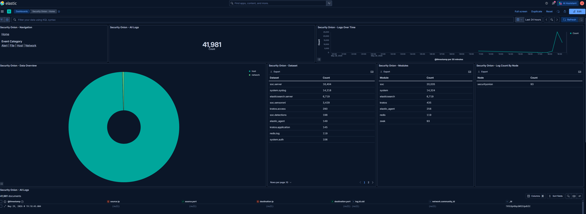
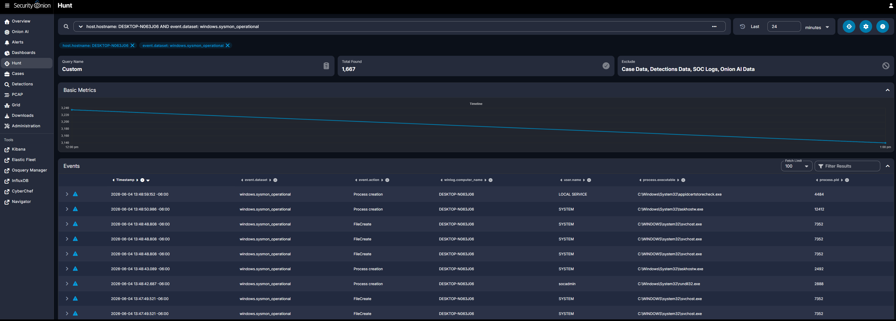

# 07 - Pipeline Verification

## Overview

Every previous document built one link in a chain. This document proves the whole chain works. Pipeline verification is the moment a SOC build stops being a collection of installed tools and becomes a working detection platform: real events from the endpoint, flowing all the way through to the analyst's screen.

This phase confirms three things, from broad to specific: that Security Onion is ingesting data at scale, that the endpoint `DESKTOP-N063J06` is specifically contributing its telemetry, and that an analyst can drill into individual endpoint events in the Hunt view. It ends with a saved Hunt query and the final snapshot marking the endpoint as fully wired into the SOC.

The full data path being verified:

`Sysmon` → `Elastic Agent` → `Security Onion Fleet` → `Elasticsearch` → `Kibana / Hunt`

---

## Objectives

By the end of this phase you will have:

- Confirmed Security Onion is ingesting telemetry across the deployment
- Confirmed `DESKTOP-N063J06` is delivering its Sysmon and Windows event data
- Recorded the verified event counts from the endpoint
- A saved Hunt query for repeatable endpoint hunting
- The final `SO Hunt - Windows11 Endpoint Sysmon` snapshot

### Where this fits in the incident response lifecycle

This marks the end of **Preparation** and the readiness for **Detection and Analysis**. A SOC cannot detect what it cannot see. Verifying the pipeline is how you prove the visibility is real before you depend on it. Skipping this step is how teams discover, mid-incident, that a critical log source was never actually arriving.

---

## Prerequisites

- The Elastic Agent enrolled and showing Healthy in Fleet (Doc 06)
- Sysmon installed and logging on the endpoint (Doc 05)
- The endpoint on the 192.168.0.0/24 subnet (Doc 01)
- Access to the Security Onion web interface at https://192.168.0.50

---

## Part 1: Confirm the SIEM is ingesting

Start broad. In the Security Onion web interface, open **Kibana** (under Tools), then open the **Security Onion - Home** dashboard. Set the time range to **Last 24 hours**.

This dashboard shows the entire deployment's ingest. In this build it shows roughly **41,981 logs** in 24 hours, dominated by Security Onion's own internal telemetry (datasets like `soc.server` and `system.syslog`, modules like `soc`, `system`, and `elasticsearch`). That is exactly what a healthy standalone node looks like: the platform is busy logging its own operation, which confirms Elasticsearch and Kibana are alive and ingesting.


*The Security Onion Home dashboard, unfiltered, showing about 41,981 logs across the deployment in 24 hours.*

This proves the SIEM works. It does not yet isolate the endpoint, that is the next step.

---

## Part 2: Confirm the endpoint's telemetry

Now narrow to the endpoint. In the same dashboard's search bar, filter by the endpoint hostname using KQL:

```
DESKTOP-N063J06
```

The dashboard recalculates to show only data from the endpoint. In this build that is **4,879 events**, with this dataset breakdown:

| Dataset | Count | What it represents |
|---|---|---|
| windows.sysmon_operational | 2,787 | Sysmon events: process creation, network, DNS, registry, file |
| system.security | 821 | Windows Security log: logons and privilege use |
| elastic_agent.endpoint | 676 | Elastic Defend endpoint events |
| winlog.winlog | 146 | Windows event log channel data |
| windows.powershell | 14 | PowerShell operational and script logging |
| **Total from DESKTOP-N063J06** | **4,879** | (includes additional smaller datasets) |


*The same dashboard filtered to DESKTOP-N063J06: 4,879 events, with Sysmon as the largest source. This is the endpoint's contribution to the pipeline.*

This is the proof that matters most. The endpoint is not just enrolled, it is actively delivering rich, security-relevant telemetry, and Sysmon is the largest single source. The live count keeps climbing as the endpoint runs, so the exact number grows over time.

> **Reading the numbers:** the 41,981 from Part 1 and the 4,879 here are consistent. The 4,879 is the endpoint's slice of the larger deployment total. Sysmon (2,787) being the biggest endpoint dataset is exactly what you want, it is the highest-value source for detection.

---

## Part 3: Drill into endpoint events with the Hunt view

Dashboards show counts. The **Hunt** view is where an analyst actually investigates. Open **Hunt** from the Security Onion left menu and run this query to isolate the endpoint's Sysmon events:

```
host.hostname: DESKTOP-N063J06 AND event.dataset: windows.sysmon_operational
```

The Hunt view returns the matching events with a metrics timeline and a detailed events table. Each row shows the timestamp, `event.dataset`, `event.action` (Process creation, FileCreate, and so on), `winlog.computer_name` (confirming **DESKTOP-N063J06**), `user.name`, `process.executable`, and `process.pid`. This is the analyst-facing view: you can expand any event to see the full Sysmon detail, including command lines and hashes.


*The Hunt view filtered to DESKTOP-N063J06 Sysmon events. Every row confirms the endpoint as the source.*

This is exactly the interface and query you will use in Doc 08 to confirm detections during attack simulations.

---

## Part 4: Save the Hunt query

You will run the endpoint Sysmon query constantly, so save it for quick recall. Bookmark the Hunt query (in the browser, or save it within Hunt) under a clear name:

**SO Hunt - Windows11 Endpoint Sysmon**

with the query:

```
host.hostname: DESKTOP-N063J06 AND event.dataset: windows.sysmon_operational
```

A saved, well-named query is a small habit that pays off every time you need to jump straight to the endpoint's activity.

---

## Part 5: Take the final snapshot

The endpoint is now fully wired into the SOC: Sysmon logging, agent enrolled and healthy, and telemetry verified in Kibana and Hunt. Take the last snapshot from the timeline in Doc 04:

1. In VMware, go to **VM > Snapshot > Take Snapshot**.
2. Name it `SO Hunt - Windows11 Endpoint Sysmon`.
3. Add a description, for example "Endpoint fully enrolled, Sysmon and Windows telemetry verified in Security Onion."

This is your known-good, fully-instrumented endpoint state, the clean point you return to before running attack simulations.

---

## Pipeline data path recap

For reference, here is the full journey of a single Sysmon event from creation to analysis:

1. An action happens on the endpoint (a process starts, a DNS query is made).
2. **Sysmon** records it to the `Microsoft-Windows-Sysmon/Operational` log (Doc 05).
3. The **Elastic Agent** reads that log and ships it to Security Onion (Doc 06).
4. **Fleet** routes it and **Elasticsearch** indexes and stores it (Doc 03).
5. **Kibana** dashboards and the **Hunt** view make it searchable and visual.

Every link is now verified working.

---

## Verification

Confirm the following:

- [ ] The Security Onion Home dashboard shows the deployment ingesting (tens of thousands of logs in 24h)
- [ ] Filtering the dashboard to `DESKTOP-N063J06` returns the endpoint's events (4,879 and climbing)
- [ ] `windows.sysmon_operational` is the largest endpoint dataset
- [ ] The Hunt query returns endpoint Sysmon events with `winlog.computer_name: DESKTOP-N063J06`
- [ ] The Hunt query is saved as `SO Hunt - Windows11 Endpoint Sysmon`
- [ ] A `SO Hunt - Windows11 Endpoint Sysmon` snapshot exists

---

## Troubleshooting

### No endpoint data appears in the dashboard or Hunt

Work through these in order:

1. **Time range.** The most common cause. Widen the time picker to Last 24 hours. A narrow window may simply predate the events.
2. **Agent health.** In Fleet, confirm `DESKTOP-N063J06` is still **Healthy** (Doc 06). If it is Offline, the endpoint stopped reporting.
3. **Firewall and subnet.** Confirm the endpoint is on 192.168.0.0/24 and the `elastic_agent_endpoint` hostgroup still allows that range (Doc 06). No connectivity means no data.
4. **Sysmon.** On the endpoint, confirm the `Sysmon64` service is running (Doc 05). If Sysmon stopped, there are no Sysmon events to ship.

### The counts look lower than expected

Event counts are entirely a function of the selected time window and how long the endpoint has been running. A freshly booted endpoint over a short window will show fewer events. Widen the time range and let it run.

---

## How this maps to MITRE ATT&CK

Pipeline verification confirms the data sources behind the planned detections are actually flowing. Mapping the verified datasets to the Phase 3 techniques:

- `windows.sysmon_operational` and `windows.powershell` carry the process and script telemetry for **T1059.001 PowerShell Execution**.
- `windows.sysmon_operational` (Process Access, Event ID 10) carries the signal for **T1003 OS Credential Dumping**.
- `system.security` carries the logon events for **T1078 Valid Accounts**.

In other words, the exact data needed to detect all three Phase 3 techniques is verified as present and flowing. The Preparation phase is complete, and the SOC is ready to detect.

---

## What's Next

The pipeline is proven end to end and the endpoint is snapshotted in a known-good state. The next phase is the payoff: running MITRE ATT&CK attack simulations against the endpoint with Invoke-AtomicRedTeam and confirming the detections land in Security Onion.

> **Note:** Doc 08 covers Phase 3 and is written once the attack simulations have been run, so that every detection result it reports is real. The framework install and the simulation results live there together.

➡️ Continue to [08 - Attack Simulations](08-attack-simulations.md)
